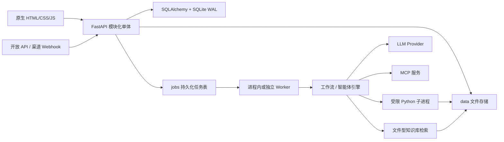

# 系统架构审计报告（2026-07-29）

> 范围：`backend/`、`frontend/`、`data/` 的运行时边界、鉴权、任务队列、工作流执行、文件存储与工程质量。  
> 方法：静态代码审查、路由/模型盘点、品牌资源集成测试、Python/JavaScript 语法检查。  
> 本报告是对 `AUDIT.md` 的当前增量复核；历史报告中标记为“已修复”的项目，只有经本次代码复核仍成立的才计入优势。

## 结论

当前系统是一个功能完整的模块化 FastAPI 单体：103 个 OpenAPI 操作、14 张数据表、持久化任务队列、可分离 worker、工作流/智能体/MCP/技能/知识库和原生前端都已形成清晰边界。它适合单机或可信内网的中小规模部署。

本轮已完成高优先级授权与沙箱修复，并同时补上应用级限流、上传边界、SQLite
外键、知识库原子写、CORS 收敛和安全响应头。仍需基础设施或密钥管理方案配合的项目是：

1. 模型、MCP、渠道凭据的数据库静态加密。
2. PostgreSQL、对象存储与跨进程事件总线迁移。
3. 移除前端内联事件后进一步收紧 CSP，并评估 HttpOnly Cookie 会话。

品牌资源未加载问题也已修复。

## 当前架构

### 规模与复杂度

| 项目 | 当前值 |
|---|---:|
| OpenAPI 路径 / 操作 | 76 / 103 |
| SQLAlchemy 表 | 14 |
| Python 文件 | 49 |
| JavaScript 文件 | 3 |
| 最大后端文件 | `pipeline/engine.py`，约 1064 行 |
| 最大前端文件 | `static/admin.js`，约 1960 行 |
| 数据形态 | SQLite + JSON-in-TEXT + 本地文件 |

## 审计发现

### P0：私有智能体可绕过可见性规则直接调用　✅ 已修复

`GET /api/v1/agents/enabled` 正确限制非 root 只能看到默认或公开智能体，但以下路径只检查“存在且启用”，没有检查 `is_public`、`is_default` 或资源归属：

- `GET /api/v1/agents/{agent_id}/form`
- `POST /api/v1/chat` 经 `resolve_agent`
- `GET /open/v1/agents`
- `POST /open/v1/chat` 与 `/multipart`

智能体 ID 为递增整数，普通用户或任意 API Key 可以枚举并调用隐藏智能体。若隐藏智能体绑定了私有模型、MCP、技能或子智能体，影响会扩展到这些能力。

修复：新增统一 `can_access_agent`，列表、表单、Web 对话、开放 API、任务 worker
执行前均复用；API Key 只可见所属账号自有、公开或默认智能体；不可见统一返回 404。
新增普通用户、跨管理员与 API Key 回归测试。

### P0：Python 步骤沙箱仍允许读取宿主机文件　✅ 已修复

`sandbox_runner.py` 的审计钩子明确允许只读 `open()`，子进程又继承项目工作目录。流程编辑者可读取 `.env`、`data/app.db`、配置文件或其他进程账号可读文件，再通过步骤结果返回。最小化环境变量不能阻止文件读取。

修复：审计钩子由“允许全部只读”改为仅允许 Python 运行时目录，业务数据必须通过
`kwargs` 显式传入；读取工作区 `.env` 的攻击用例已确认被拦截。生产高强度隔离仍建议使用
一次性容器或低权限独立账号。

### P1：导出文件下载缺少对象归属校验　✅ 已修复

`GET /api/v1/exports/{filename}` 只要求登录并检查路径位于 `EXPORT_DIR`，没有校验文件对应的 `Conversation.user_id`。文件名包含短随机后缀，能降低盲猜概率，但不能替代授权。

修复：下载时要求文件名精确匹配当前用户会话的 `export_files`；root 保留审计访问。
后续若增加跨系统分享，仍应使用短期签名 URL。

### P1：凭据明文落库　🟡 部分修复

模型提供商 `api_key`、MCP `headers`、渠道 `token`/`app_secret` 均以明文存储。接口响应做了隐藏，开放 API Key 也只保存哈希，这两点是正确的；但数据库文件或备份泄露仍会暴露上游凭据。

已修复公开 MCP 只读视图泄露鉴权头、MCP 导出携带鉴权头的问题；开放 API Key 继续只存
哈希。数据库静态加密仍待部署级主密钥或外部 Secret Manager，不能安全地从现有 JWT
密钥临时派生。

后续建议：

- 用部署级主密钥做 envelope encryption；数据库只存密文、nonce 和版本。
- 密钥不写日志，不进入导出文件；轮换时保留密钥版本。
- 将 `.env`、数据库和备份的 OS ACL 分离，并建立备份加密与恢复演练。

### P1：登录与开放接口无速率限制　✅ 已修复（单进程）

登录、API Key 验证、开放聊天和渠道入口未见 IP/账号/Key 级限流或登录失败锁定。风险包括口令枚举、Key 猜测和高成本 LLM 调用滥用。

修复：新增滑动窗口限流，覆盖登录 IP+账号、Web 聊天用户、开放 API IP+Key、通用渠道与
微信回调；返回 429 与 `Retry-After`。阈值均可通过环境变量配置。多副本仍应在网关或
Redis 增加全局限流。

### P1：上传先整体读入内存，且上传件无生命周期清理　✅ 已修复

多处逻辑执行 `await file.read()` 后才检查大小；导入接口中部分文件没有显式上限。聊天上传件落到 `data/uploads`，任务 TTL 清理只删除任务行，不清理关联文件和 `.name` 旁车文件。长期运行会导致内存峰值和磁盘持续增长。

修复：聊天文件分块落盘并在累计过程中执行大小上限；管理端 JSON/ZIP/模板/知识库上传也
统一为有上限分块读取；worker 周期清理超过 `UPLOAD_TTL_SECONDS` 且未被活动任务引用的
上传件。后续可继续增加单用户磁盘配额与水位告警。

### P1：SQLite 外键约束未启用，删除用户会产生悬挂引用　✅ 已修复

模型声明了多个 `ForeignKey`，但 SQLite 连接只设置 WAL 和 `busy_timeout`，没有 `PRAGMA foreign_keys=ON`；删除用户时也没有显式处理其智能体、API Key、渠道、会话等资源。JSON-in-TEXT 中的 ID 引用更不受数据库约束。

修复：SQLite 每连接启用 `PRAGMA foreign_keys=ON`；删除仍有关联数据的用户返回 409；
删除智能体前阻止渠道悬挂并解除会话/任务引用；删除智能体、MCP、技能时同步清理相关
JSON ID 列表。启用前扫描并修复了现有库中唯一一条孤儿引用：保留会话 #4，仅将其已失效的
`agent_id` 置空。长期仍建议把 JSON ID 迁移到关联表。

### P2：知识库元数据存在并发覆盖与线性检索瓶颈　🟡 部分修复

`_datasets.json` 与 `_deleted_builtins.json` 采用无锁的读—改—写，写入也不是临时文件 + 原子替换。并发管理操作可能相互覆盖，异常退出可能留下不完整 JSON。检索每次扫描并切分语料，规模增长后延迟近似随语料线性上升。

修复：元数据读改写增加跨线程/跨进程文件锁，并使用同目录临时文件 + `fsync` + 原子替换。
线性检索瓶颈仍在；语料规模扩大前应引入预计算分块和倒排/向量索引。

### P2：水平扩展仍受本地状态限制

任务行已持久化，worker 也能独立运行，这是正确方向；但 SQLite、本地文件、进程内流式缓冲/订阅者意味着多 API 副本下存在存储共享、锁竞争和流式事件丢失问题。开放 API 仍直接执行完整工作流并在请求期间持有数据库会话，没有复用后台任务队列。

建议：

- 多副本前迁移 PostgreSQL、对象存储和 Redis/NATS 等事件总线。
- Web 与开放 API 统一走任务队列；同步接口可在短超时内等待，超时返回 `job_id`。
- worker 领取在 PostgreSQL 上改用 `FOR UPDATE SKIP LOCKED`，并增加幂等键与最大重试次数。

### P2：浏览器安全边界偏弱　🟡 部分修复

JWT 存在 `localStorage`；前端大量使用 `innerHTML` 和内联事件；服务端未见 CSP、HSTS、`X-Content-Type-Options`、`Referrer-Policy` 等统一安全头，CORS 允许任意来源。当前 Markdown 路径先转义是优点，但一旦出现单个 XSS 漏洞，长期 JWT 可被直接读取。

修复：CORS 从任意来源改为默认关闭、精确 Origin 配置；新增 CSP、nosniff、DENY framing、
Referrer-Policy、Permissions-Policy，并在 HTTPS 请求上启用 HSTS。

后续建议：

- 优先使用 `HttpOnly + Secure + SameSite` 会话 Cookie，配套 CSRF 防护；或缩短访问令牌并引入刷新/撤销机制。
- 去除内联事件与不必要的 `innerHTML`，添加 nonce/hash 型 CSP。
- 由部署配置明确 CORS 白名单、可信 Host、HTTPS/HSTS 与代理头策略。

### P2：迁移和前端模块化需要工程化

`main.py::_migrate` 使用手写 DDL；它已包含删列分支，继续扩展后难以保证跨数据库、回滚和多版本升级。`admin.js`、`engine.py`、`chat.py`、`flows.py` 都已超过适合单文件维护的规模。

建议：

- 引入 Alembic，并建立“备份—迁移—验证—回滚”发布步骤。
- 把前端按 API client、状态、视图、领域组件拆分为 ES modules；逐步移除全局函数。
- 把引擎的解析、工具循环、上下文压缩、工作流执行拆成可单测模块。

## 已确认的优势

- PBKDF2-HMAC-SHA256 + 随机 salt，API Key 只存 SHA-256 哈希。
- 默认 JWT 密钥/首次 root 默认口令在非开发模式下阻止启动。
- MCP 与管理端模型 URL 经过 SSRF 私网/保留地址检查，并支持显式 allowlist。
- 长任务使用持久化 jobs 表、心跳租约、取消标记和可分离 worker；HTTP 对话提交不再持有长会话。
- SQLite 使用 WAL 与 30 秒 busy timeout，符合单机并发的现实选择。
- 用户资源采用 `created_by + is_public`，并提供 `scope_owned/require_owner/require_use` 统一辅助函数；问题主要是少数调用链没有复用。
- 上传、模板、知识库和导出目录按用途隔离；导出下载已有路径穿越防护。
- 品牌静态目录现在单独挂载，没有暴露整个 `data` 目录。

## 建议实施顺序

1. ~~智能体直接 ID 越权、导出文件 IDOR、Python 步骤读取宿主文件。~~ ✅
2. ~~登录/API Key/开放聊天应用级限流。~~ ✅
3. ~~上传流式限额与生命周期清理、SQLite 外键、知识库原子写、安全响应头。~~ ✅
4. 下一步：部署级凭据加密、Alembic、前端移除内联事件并收紧 CSP。
5. 扩容前：PostgreSQL + 对象存储 + 事件总线，并统一 Web/开放 API 的任务执行路径。

## 本次验证

- `python -m unittest tests.test_branding tests.test_security_regressions -v`：12/12 通过。
- `python -m compileall -q backend tests`：通过。
- `node --check`：`common.js`、`admin.js`、`app.js` 均通过。
- FastAPI 集成检查：首页、登录页、管理页、品牌静态资源、manifest 图标、公共品牌接口及 Logo 接口均返回成功。
- 安全头与 CORS 集成检查通过；24 路并发知识库元数据读取通过。
- 未执行会调用真实外部模型的完整业务生成链路；本次修复不涉及 LLM/工作流计算逻辑。
