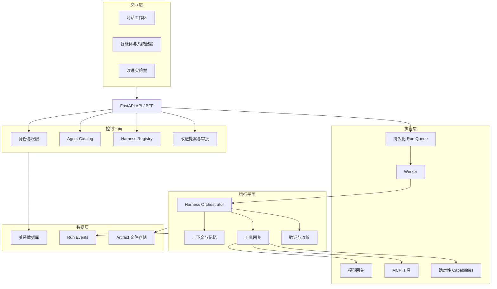
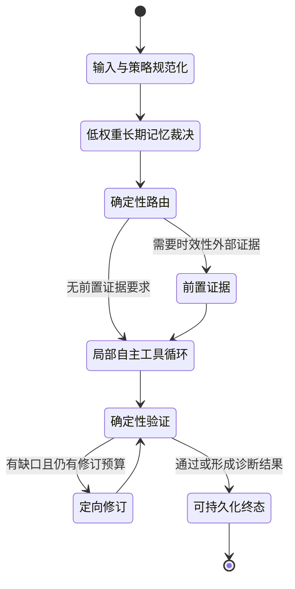
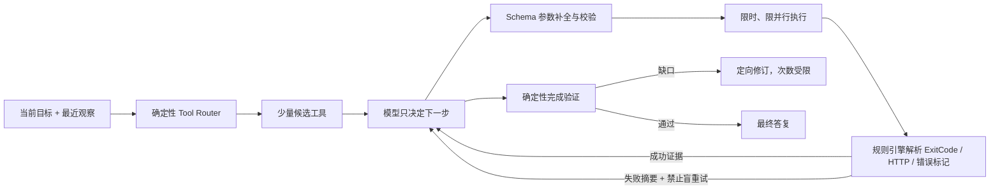
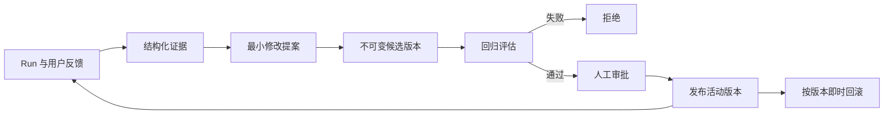
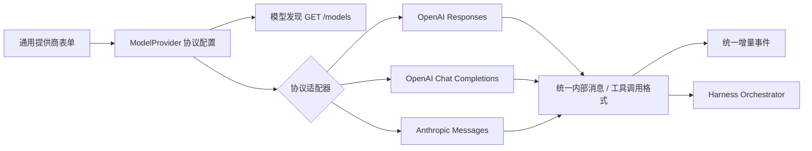
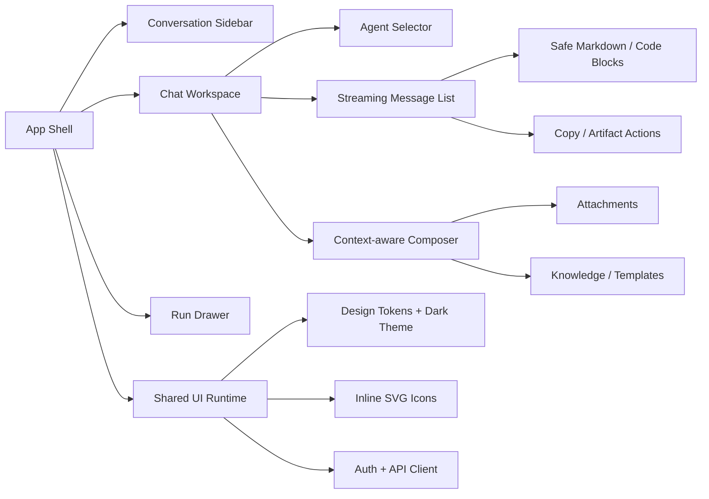
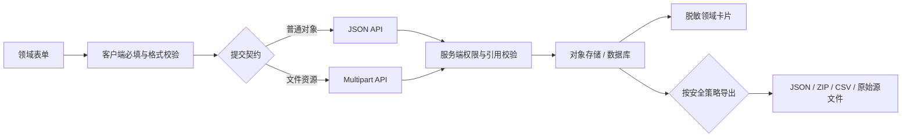

# Harness 智能体平台架构

## 系统边界



## 薄宏观 Graph 与局部运行循环



`harness_macro@1.1` 只控制稳定生命周期。搜索、读文件、工具调用和子智能体委派
仍位于 `agent_loop` 节点内部，不展开成宏观节点。Graph 负责合法转换、当前节点、
图版本和节点事件；`resolve_memory` 负责按作用域、相关性、时间新近度和预算裁决
长期记忆候选。Harness 继续负责权限、沙箱、任务、工具和审批。

### 小模型确定性控制层

`HarnessVersion` 中的四类策略不是展示性配置。Worker 在 Run 开始时把它们规范化为
`RuntimePolicies` 快照并交给 Orchestrator，主智能体和子智能体使用同一控制契约：



默认 `small_model` 策略把规划改为单步决策，并由 Runtime 接管以下工作：

- 工具目录超过阈值时，按目标、近期观察、工具说明和参数字段筛选候选。
- 对工具参数做默认值填充、常见同义字段映射、基础类型转换与必填校验。
- 每轮仅执行策略允许的调用数；其余调用返回“未执行”观察，避免并行偏航。
- 工具输出先由规则引擎判断成功/失败、截断噪声并给出可操作约束。
- 早期工具观察超过上下文预算后自动压缩；成功工具调用达到预算时进入最终验证，
  防止检索型任务持续堆积上下文。
- 相同调用使用 Run 内缓存；连续重复或超过工具调用预算时确定性停止。
- 最终答复按必需项、禁止项、最小长度和工具成功证据验证，失败时定向修订。
- `graph.*`、`tools.routed`、`tool.called`、`tool.completed`、
  `verification.completed` 等事件追加到 `run_events`，支持图、节点和工具三级评估。

策略示例：

```json
{
  "tool_policy": {
    "profile": "small_model",
    "max_iterations": 8,
    "max_parallel_calls": 1,
    "max_successful_calls": 4,
    "timeout_seconds": 45,
    "max_output_chars": 4000,
    "context_budget_chars": 24000,
    "compact_chars": 1200,
    "argument_repair": true,
    "router": {
      "enabled": true,
      "activation_threshold": 10,
      "max_candidates": 6
    }
  },
  "memory_policy": {
    "enabled": true,
    "scope": "agent",
    "top_k": 3,
    "min_relevance": 0.12,
    "influence": 0.35,
    "relevance_weight": 0.85,
    "recency_weight": 0.15,
    "max_chars": 1800,
    "exclude_current_session": true,
    "recent_messages": 6,
    "budget_ratio": 0.7,
    "summary_chars": 5000
  },
  "verification_policy": {
    "required": true,
    "strict": false,
    "max_revisions": 1,
    "required_terms": [],
    "forbidden_terms": []
  },
  "output_policy": {
    "concise": true,
    "max_chars": 30000
  }
}
```

所有数值在运行时限幅。若使用高能力模型，可把 `profile` 设为 `standard`，放宽并行调用；
工具 Schema 校验、预算、失败解析和验证门禁仍保留，从而避免 Harness 与单一模型绑定。

### 推理模型空流恢复

Chat Completions 流式适配器区分正文 `content` 与内部
`reasoning_content`。内部推理只用于判断响应状态，不进入用户流或日志正文。
若 SSE 正常结束但没有正文或只包含 `<think>` 思考块，Runtime 不再机械重放
同一个流式请求，而是：

1. 追加“只输出最终答复”的确定性指令。
2. 对支持的推理模型把推理强度降为 `low`。
3. 只执行一次非流式恢复请求。
4. 恢复成功后把最终正文作为单个增量交给原流式通道；仍无正文时返回包含
   `finish_reason` 的可诊断错误。

该路径兼容 NVIDIA GPT-OSS 的 `reasoning_content` 返回格式，同时不向用户暴露思维链。
对于 `nvidia/nemotron-3-*`，最终答复阶段按官方 Chat Template 契约设置
`chat_template_kwargs.enable_thinking=false`，避免有限输出预算全部消耗在推理上；
工具规划阶段仍保留模型自身的推理能力。

## Harness 版本与改进门禁



约束：

1. 生产版本不可原地修改。
2. 未通过评估的提案不能批准。
3. 提案不能自行上线，必须由有权限的人批准。
4. 每个 Run 固定记录提交时的 Harness 版本。
5. 用户可编辑的流程表、步骤表、流程 API 和画布保持移除；运行时只保留代码定义、
   受版本控制的薄宏观 Graph，禁止恢复成通用流程搭建器。

## 主要数据实体

- `agents`：身份、可见性、模型与能力绑定。
- `harness_versions`：指令、工具策略、记忆策略、验证策略和输出策略。
- `jobs`：持久化 Run 状态和执行租约。
- `run_events`：追加式运行事件。
- `conversations`：多轮会话消息记录。
- `improvement_proposals`：证据、假设、候选版本、评估和审批状态。
- `skills`、`mcp_servers`、`model_providers`：可绑定能力。
- `templates` 与文件目录：Artifact 渲染。

## 模型网关协议层

模型提供商不再按 OpenAI、Azure、NVIDIA、Anthropic 等厂商写死适配器，而是保存协议、认证和传输参数。OpenAI 兼容协议支持 Responses 与 Chat Completions 两条线路；Anthropic 兼容协议使用 Messages 线路。模型列表、普通生成、工具调用、视觉输入和流式输出都从同一份提供商配置构造。



配置分为六组：连接与协议、认证、模型选择、生成参数、超时与重试、高级请求参数。API Key 与敏感自定义请求头不回传明文；模型识别既支持未保存表单，也支持复用已保存凭据。

## 前端交互架构

当前部署由 FastAPI 直接托管静态资源，因此不额外引入 Next.js 运行时。界面按 React 式组件边界组织为原生 JavaScript 渲染函数，共享设计令牌、图标、Markdown 和主题能力；后续需要多人并行开发或独立前端部署时，可沿相同边界迁移为 React 组件。



交互约束：

1. 流式回答只更新当前消息节点，不重绘整个对话列表。
2. Markdown 输入先转义再渲染；代码块独立显示并支持复制。
3. 对话状态、当前智能体和用户偏好保存在页面状态与本地存储，服务端仍是会话事实来源。
4. 移动端侧栏使用遮罩和显式关闭状态；桌面端保持稳定双栏布局。
5. 管理控制台与对话页共享同一套设计令牌、图标和主题，不维护两套视觉系统。
6. `prefers-reduced-motion`、键盘焦点和 ARIA 标签作为基础可访问性契约。
7. `@` 从统一对话目录引用知识库与输出模板；模板名称、结构和可见示例会作为输出契约注入模型。带占位符模板按字段替换，无占位符模板将示例正文替换为新生成内容。`/` 显式选择 Skill、MCP 或子智能体，选择项以结构化 ID 提交并校验权限。
8. 输入框模型选择器默认遵循智能体路由，只列出管理后台明确开放的模型；显式模型 ID 在 API 入队与 Worker 执行时再次校验开放状态。
9. 品牌 Logo 只作为内容图片使用；操作色、状态色和按钮样式来自独立设计令牌，不从 Logo 提取或推导。
10. 智能体运行时在回答消息中展示可审计的工作状态、已用时、当前动作和步骤计数；不展示内部推理文本。
11. 桌面侧栏折叠由外层布局统一管理，并在对话标题栏保留独立展开入口；移动端使用遮罩抽屉，不共享桌面负边距状态。
12. 运行中话题以持久化 Job 为事实来源；页面刷新或从管理后台返回时重新查询当前用户的活动任务、在侧栏置顶显示并恢复流式订阅。

### 管理控制台对象交互

管理端不暴露数据库 JSON 字段。页面按领域对象生成表单，请求层仍提交结构化 JSON 或 `multipart/form-data`，导入导出格式由资源的生命周期和安全属性决定。

| 功能 | 创建/修改 | 导入 | 导出 |
|---|---|---|---|
| 智能体 | 身份、指令、模型、Skill、MCP、子智能体选择器 | 智能体 JSON 配置 | 勾选后导出 JSON |
| 知识库 | 创建主题库、设置可见性 | 向指定库批量上传文档 | CSV 目录清单 |
| MCP | 连接向导、请求头键值行、连通性测试 | 批量 JSON | 单项或全部 JSON |
| Skill | 触发说明、执行指令、资源行 | `SKILL.md`、ZIP、JSON | 单项 ZIP 或全部 JSON |
| 模板 | 元数据 + Word/PPT/Excel/Markdown 源文件 | 源文件或模板 ZIP | 源文件或完整模板 ZIP |
| 模型 | OpenAI/Anthropic 兼容协议、认证、线路、模型发现、生成与可靠性参数 | 本机 Codex 登录凭据 | 排除密钥和敏感请求头值的安全配置 |
| API 密钥 | 按用途签发，一次性展示明文 | 不允许 | 不允许 |
| 第三方接入 | 渠道类型、智能体、公众号凭据 | 不允许 | 复制已生成的接入地址 |
| 用户 | 角色、状态、模块权限清单 | 含初始密码的 CSV | 不含密码的账号 CSV |
| 系统设置 | 页面内通用设置表单、公开地址、独立 Logo 上传 | 不允许 | 不允许 |
| 操作日志 | 按时间、操作者、操作、资源、状态和 IP 的只读列表；支持 10/20/50/100 条分页 | 不允许 | CSV 审计留档 |


