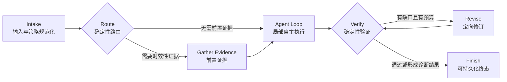

# Harness Engineering：智能体支架/运行外壳工程

## 0. 当前架构升级决策（2026-07-31）

当前系统采用：

> **厚 Harness + 薄宏观 Graph + 自主 Agent Loop**

本次升级不把每一次搜索、读文件或工具调用建成节点，而是只把稳定、可枚举、
需要审计的生命周期显式化。开放式探索仍由现有 `run_harness()` 内的短 Agent Loop
完成。



### 0.1 职责边界

| 层 | 负责 | 不负责 |
| --- | --- | --- |
| Harness Runtime | 权限、沙箱、工具、上下文、预算、超时、审计、任务生命周期 | 预先规定开放任务的全部步骤 |
| Macro Graph | 宏观节点、合法边、当前状态、图版本、节点事件 | 展开每一次工具调用 |
| Agent Loop | 当前节点内的局部规划、工具选择、观察与收敛 | 绕过 Graph 的验证和终态门禁 |
| Validator | 机械完成条件、证据要求、输出约束 | 代替真实业务验收 |
| Human | 不可逆或高风险决策 | 重复处理可程序化规则 |

### 0.2 一等节点与合法转换

宏观图定义位于
[`backend/runtime/graph.py`](/D:/SOFTWARE/AppData/Desktop/agent/backend/runtime/graph.py)，
节点和边都是不可变定义。`GraphRun.move()` 会拒绝未声明的跳转，例如
`route → finish`，因此模型和业务代码都不能绕过执行、验证节点直接完成。

| 节点 | 类型 | 输入/输出责任 |
| --- | --- | --- |
| `intake` | 确定性 | 规范化策略、系统指令和非可信上下文边界 |
| `route` | 确定性 | 建立工具目录，判断是否需要前置证据 |
| `gather_evidence` | 确定性 | 对实时问题先执行绑定的联网证据工具 |
| `agent_loop` | Agentic | 在工具、次数、并行度和上下文预算内局部探索 |
| `verify` | 确定性 | 验证最小长度、必需项、禁止项和证据条件 |
| `revise` | Agentic | 只修订验证缺口，不再自由扩张任务 |
| `finish` | 终态 | 生成允许持久化的非空输出 |

### 0.3 统一 GraphState

`GraphState` 只保存控制面最小状态：

```text
graph_id / graph_version
current_node / visited_nodes / route
required_evidence_tools
successful_tools / successful_tool_names
loop_iterations
verification_issues / revision_count
terminal_status
```

它不保存原始提示词、消息正文、工具原始输出或凭据。这样节点快照可以写入
`RunEvent`，又不会复制大上下文或扩大敏感数据暴露面。业务输入仍由 `TaskInput`
负责，两者禁止混为一个不断膨胀的共享对象。

### 0.4 版本、事件与评估

当前图标识为 `harness_macro@1.0`。入队时的 Harness 执行快照会同时固化 Graph
版本；执行时只允许从版本注册表解析，未知版本直接失败，禁止排队任务静默切换到
另一张图。

统一事件包括：

```text
graph.started
graph.node.started
graph.node.completed
graph.transition
graph.completed
```

节点事件携带安全状态快照，可以分别统计路由分支、证据节点成功率、Agent Loop
轮数、验证修订率和终态完成率。原有 `tool.*`、`verification.*` 事件继续保留，
形成“图级 → 节点级 → 工具级”的三级观测。

### 0.5 当前恢复语义

必须区分两个概念：

- **已实现：** 节点状态快照和追加式事件，可定位任务最后到达的节点并进行回放分析；
- **已有但仍为重跑：** Worker 崩溃和人工批准后，Job 可以重新入队，但 Agent Loop
  会从头执行；
- **尚未实现：** 持久化完整消息、工具幂等结果和外部副作用事务后，从指定节点真正
  断点续跑。

在完整恢复协议落地前，文档和界面不得把节点快照称为“可断点恢复检查点”。

### 0.6 强制不变量

1. 所有正常输出必须经过 `verify` 才能进入 `finish`。
2. 空答复是硬失败，不能因验证策略设置为非严格而保存为成功。
3. 实时问题由 `gather_evidence` 前置取证，不能让弱模型用工作区遍历代替联网。
4. 图只管理稳定阶段，工具循环不得展开成节点网络。
5. Graph 版本、Harness 版本和能力快照共同决定一次 Run 的可复现执行契约。
6. 高风险工具仍由 Harness 权限和 Job 审批控制；后续只有在具备可恢复状态后，
   才把 `human_approval` 提升为可暂停/恢复的显式节点。

### 0.7 后续演进顺序

```text
P0（已完成）
显式薄 Graph + GraphState + 合法边 + 图版本 + 节点事件

P1
节点级指标聚合 + 路由混淆矩阵 + 验证失败分类 + 图版本对比评估

P2
幂等工具结果仓 + 持久化执行上下文 + 审批节点 + 真正断点续跑

P3
从真实轨迹提取稳定模式，按业务域增加小型子图
```

增加业务子图必须同时满足：路径高频稳定、成功标准可机械验证、错误代价足够高。
未知故障排查、研究和复杂编码继续留在 Agent Loop，不为“看起来更可视化”而建图。

------

## 1. Harness是什么意思

Harness原义是“马具、线束、约束装置”。在AI Agent领域，它表示：

> 围绕模型建立的一整套工具、运行时、上下文、控制、验证和安全基础设施。

LangChain给出的直接定义是：

```
Agent = Model + Harness
```

并把Harness概括为模型之外的代码、配置和执行逻辑，包括系统提示词、工具、Skill、MCP、文件系统、沙盒、编排逻辑、Hook和中间件。[LangChain](https://www.langchain.com/blog/the-anatomy-of-an-agent-harness)

------

## 2. Harness包含什么

一个成熟Harness通常包括以下层面。

### 2.1 指令系统

- System Prompt；
- AGENTS.md；
- 项目规范；
- 编码规则；
- 领域术语；
- 操作边界；
- 任务完成标准。

------

### 2.2 上下文系统

- 对话历史；
- 当前任务状态；
- 项目文档；
- 文件索引；
- 短期记忆；
- 长期记忆；
- RAG；
- Context压缩；
- Progressive Disclosure，渐进式披露。

OpenAI在Codex实践中没有把所有知识堆进一个庞大的`AGENTS.md`，而是把它作为目录，让Agent逐步读取结构化、版本化的项目文档；同时通过Linter和CI检查文档新鲜度与结构。[OpenAI](https://openai.com/index/harness-engineering/)

------

### 2.3 工具系统

- 文件读写；
- 命令行；
- 浏览器；
- 数据库；
- Git；
- 邮件；
- 日历；
- API；
- MCP；
- Skill；
- 搜索；
- 代码执行。

工具不仅需要“存在”，还要有：

- 清晰描述；
- 结构化参数；
- 权限限制；
- 超时；
- 重试策略；
- 返回Schema；
- 错误信息；
- 审计日志。

------

### 2.4 执行环境

- 沙盒；
- 容器；
- 虚拟机；
- 临时工作区；
- Git worktree；
- 依赖管理；
- 网络策略；
- Secret管理；
- CPU、内存和磁盘限制。

模型本身不能执行代码、访问实时信息或维护持久状态，这些能力都由Harness提供。[LangChain](https://www.langchain.com/blog/the-anatomy-of-an-agent-harness)

------

### 2.5 编排系统

Harness中通常包含：

- Agent Loop；
- Graph；
- 子Agent；
- 任务队列；
- 路由；
- 模型选择；
- 并行执行；
- 检查点；
- 暂停与恢复。

所以从范围上看：

```
Loop Engineering  ⊂ Harness Engineering
Graph Engineering ⊂ Harness Engineering
```

这不是严格学术集合关系，而是非常实用的工程理解。

------

### 2.6 安全与权限

- 最小权限；
- 工具白名单；
- 敏感操作确认；
- 路径限制；
- 网络出口限制；
- Secret隔离；
- 数据脱敏；
- 审批；
- 速率限制；
- 预算限制。

例如：

```
读取仓库：自动允许
修改分支：自动允许
推送远程：需要审批
合并主分支：必须人工批准
删除生产数据：禁止
```

------

### 2.7 验证系统

- 单元测试；
- 集成测试；
- 类型检查；
- Linter；
- 安全扫描；
- 业务规则；
- LLM Judge；
- 人工Review；
- 验收标准；
- 回归测试集。

------

### 2.8 可观察性

- Trace；
- 日志；
- Token；
- 成本；
- 延迟；
- 工具成功率；
- 节点失败率；
- 重试次数；
- 任务完成率；
- 人工介入率；
- 输出质量分。

------

### 2.9 反馈和自我改进

当Agent失败时，不应只修改提示词，而应判断失败属于哪一层：

```
缺少知识       → 改上下文/RAG
工具不会使用   → 改工具描述或Skill
工具能力不足   → 新增工具
路径错误       → 改Graph
反复失败       → 改Loop和停止条件
越权操作       → 改权限和Guardrail
无法判断完成   → 改验证器
项目难理解     → 改文档与代码结构
```

OpenAI的Harness Engineering实践强调：Agent失败时，重点不是要求模型“更努力”，而是识别缺失的能力、工具、结构、约束或可读信息，并把解决方案编码到环境中。[OpenAI](https://openai.com/index/harness-engineering/)

------

## 3. Harness Engineering的核心设计原则

### Agent Legibility：对Agent可读

人能理解，不代表Agent能理解。

Agent需要：

- 明确目录；
- 结构化文档；
- 可检索的决策记录；
- 可执行的测试；
- 清晰错误消息；
- 稳定工具Schema；
- 明确完成标准。

OpenAI将“Agent legibility”作为核心目标：凡是运行时无法访问的知识，对Agent而言实际上等于不存在。[OpenAI](https://openai.com/index/harness-engineering/)

------

### Enforceability：规则可执行

弱规则：

```
请保持良好的架构。
```

强规则：

```
禁止跨层依赖；
由结构测试和自定义Linter自动检查。
```

弱规则依赖模型记住，强规则由系统强制执行。

OpenAI的实践包括通过自定义Linter、结构测试、命名约束、文件大小限制和带修复说明的错误消息，把架构规则直接编码到开发环境。[OpenAI](https://openai.com/index/harness-engineering/)

------

### Progressive Disclosure：渐进式披露

不要一开始把所有信息全部塞给模型。

```
入口说明
→ 目录
→ 任务相关文档
→ 具体实现
→ 必要历史记录
```

这样可以降低：

- Token消耗；
- 上下文噪声；
- 错误检索；
- 过时规则干扰。

------

### Reproducibility：可复现

一次Agent运行最好能够重放：

```
模型版本
提示词版本
工具版本
输入数据
环境版本
随机参数
执行轨迹
输出产物
```

否则无法判断改动为什么变好或变差。

------

### Model Replaceability：模型可替换

Harness不应与单一模型深度绑定。

理想状态：

```
GPT模型
Claude模型
本地模型
小模型
```

可以在相同Graph、工具和验证体系中替换，只针对能力差异做少量调整。


**Harness Engineering 和 Graph Engineering 通常不是二选一，而是不同层级。**

- **Harness Engineering**解决的是：模型在什么运行环境中工作，拥有哪些工具、上下文、状态、权限、沙箱、验证、恢复和审计机制。
- **Graph Engineering**解决的是：任务按照哪些节点、状态和路径推进，哪些地方由程序决定，哪些地方允许模型自主判断。

更准确的关系是：

```
Harness Engineering
├── 上下文与知识管理
├── 模型与工具接入
├── 状态、线程与持久化
├── 沙箱、权限与审批
├── 重试、超时与预算
├── 评估、日志与可观测性
└── 工作流控制
    ├── 自由 Agent Loop
    ├── 固定 Pipeline
    └── Graph / State Machine
```

因此，**Graph 通常是 Harness 内部的一种控制流实现方式**。LangChain 对 Graph Engineering 的定义也是用节点、边、状态和转换显式描述工作流；节点可以是确定性代码、单次模型调用、工具调用，甚至是一个拥有内部循环的完整 Agent。[LangChain](https://www.langchain.com/blog/3-years-of-graph-engineering-with-langgraph)

------

# 一、两者到底有什么区别

| 维度         | Harness Engineering                  | Graph Engineering                  |
| ------------ | ------------------------------------ | ---------------------------------- |
| 核心对象     | Agent 的整个运行环境                 | Agent 的任务控制流                 |
| 主要问题     | 如何让模型长期、安全、稳定地工作     | 任务下一步应该进入哪个节点         |
| 控制方式     | 策略、工具、上下文、反馈、沙箱、验证 | 节点、边、条件、状态转换           |
| 自主程度     | 可以很高，也可以很低                 | 通常比自由 Agent Loop 更受约束     |
| 适合任务     | 开放式、步骤未知、长期任务           | 结构明确、阶段稳定、合规性高的任务 |
| 主要优势     | 灵活、通用、可持续运行               | 可预测、可解释、可测试             |
| 主要风险     | 行为隐蔽、系统复杂、错误可能累积     | 流程僵化、状态爆炸、图逐渐失控     |
| 对低能力模型 | 提供工具和环境，但未必能补足决策能力 | 能显著降低规划和工具选择负担       |

Anthropic 将 Agent Harness 定义为使模型能够表现为智能体的整个脚手架，包括输入处理、工具编排和结果返回；OpenAI 的 Codex Harness 还包含线程持久化、认证配置、沙箱工具执行、MCP、Skills 和审批等运行能力。[Anthropic](https://www.anthropic.com/engineering/demystifying-evals-for-ai-agents)

------

# 二、Harness Engineering 的架构优势

## 1. 更适合开放式任务

例如：

```
调查一个线上故障
分析陌生代码库
完成复杂重构
开展深度研究
```

这些任务很难预先确定：

- 需要查多少文件；
- 调用多少次工具；
- 是否需要回退；
- 什么时候发现新问题；
- 是否需要改变原计划。

这时可以采用：

```
观察环境
   ↓
模型决定下一步
   ↓
调用工具
   ↓
读取结果
   ↓
重新判断
   ↓
继续或结束
```

这种开放循环允许模型根据真实环境反馈动态调整。Anthropic 也将步骤数量不可预测、无法预先硬编码路径的任务视为自主 Agent 更合适的场景。[Anthropic](https://www.anthropic.com/engineering/building-effective-agents)

## 2. 能承载完整的生产能力

Harness 不只是一个循环，它还可以统一处理：

```
模型选择
工具协议
线程管理
状态持久化
上下文压缩
权限审批
沙箱隔离
超时取消
失败恢复
成本控制
日志追踪
评估回放
```

例如 Codex Harness 将线程生命周期、配置认证、工具执行、MCP、Skills 和策略模型统一放在一个运行时中，因此同一核心能力可以被 CLI、IDE、桌面端和 Web 端复用。[OpenAI](https://openai.com/index/unlocking-the-codex-harness/)

## 3. 对长期任务更加友好

Harness 可以保存：

- 当前计划；
- 已完成事项；
- Git 提交；
- 检查点；
- 失败原因；
- 剩余工作；
- 下一轮所需上下文。

Anthropic 的长期任务实践表明，即使是前沿模型，仅依赖上下文压缩也不够；还需要初始化环境、进度文件、功能清单和增量工作机制，帮助后续 Agent 实例恢复准确状态。[Anthropic](https://www.anthropic.com/engineering/effective-harnesses-for-long-running-agents)

## 4. 可以构建“模型可读环境”

高质量 Harness 会把组织知识转化为 Agent 可以发现和验证的内容，例如：

```
AGENTS.md
ARCHITECTURE.md
设计文档
执行计划
质量规范
测试用例
安全规则
CI检查
```

OpenAI 的实践不是把全部说明塞入一个巨大提示词，而是将简短入口作为“目录”，再让 Agent 按需读取结构化、版本化的知识，并通过 CI 和文档维护机制防止知识腐化。[OpenAI](https://openai.com/index/harness-engineering/)

------

# 三、Harness Engineering 的缺点和盲点

## 1. Harness 太宽，边界容易失控

随着系统发展，Harness 往往不断增加：

```
Memory
Planner
Tool Router
Policy
Checkpoint
Evaluator
Reflection
Retry
Scheduler
Watchdog
Multi-Agent
```

最后容易变成一个庞大的“Agent 操作系统”。

问题是：

- 修改一层会影响其他层；
- 很难判断失败来自模型、提示词、工具还是运行时；
- 调试需要重放完整轨迹；
- 升级模型时旧约束可能不再合理。

Harness 编码的本质是“开发者认为模型不能独立完成什么”。当模型能力变化时，这些假设可能过期，因此 Harness 需要持续重新评估，而不能只增加约束。[Anthropic](https://www.anthropic.com/engineering/managed-agents?utm_source=chatgpt.com)

## 2. 自由循环中的错误会累积

自由 Agent Loop 可能出现：

```
错误假设
  ↓
错误搜索
  ↓
错误工具调用
  ↓
错误总结
  ↓
基于错误结果继续规划
```

单步错误可能不严重，但在十几轮之后会形成严重偏航。

特别是低能力模型，容易表现为：

- 重复调用同一工具；
- 忘记最初目标；
- 把中间状态误认为最终完成；
- 根据不完整证据提前停止；
- 不会主动触发验证。

Anthropic 在长期任务实验中观察到，即使是前沿模型，也会试图一次完成过多内容，或者看到已有进展后提前宣布完成。[Anthropic](https://www.anthropic.com/engineering/effective-harnesses-for-long-running-agents)

## 3. 验证器不等于真实世界

Harness 常常通过以下方式判断成功：

```
测试通过
HTTP 200
工具返回 success
Judge 模型评分合格
```

但这些只能证明“验证条件满足”，不能证明业务目标真正实现。

例如：

- 单元测试通过，但用户流程仍不可用；
- SQL 执行成功，但更新了错误记录；
- 页面返回 200，但内容为空；
- Judge 模型和生成模型犯了同一种错误。

Anthropic 特别区分了“轨迹中的 Agent 声称成功”和“环境中的最终结果确实存在”；例如订票 Agent 说已经预订，不等于数据库里真的存在预订记录。[Anthropic](https://www.anthropic.com/engineering/demystifying-evals-for-ai-agents)

这属于 Harness 的重要盲点：

> Harness 可以提高执行纪律，但不能自动解决“成功标准是否正确”。

## 4. 环境越丰富，攻击面越大

Harness 给模型增加了能力，同时也增加了风险：

- Shell；
- 文件系统；
- 浏览器；
- 数据库；
- 邮件；
- MCP；
- 内网接口；
- 凭据；
- 自动审批。

Harness 的安全性最终取决于：

```
最弱的工具接口
最宽的权限配置
最不完整的策略规则
最容易绕过的审批路径
```

因此，Harness 不能只强调“模型更能干”，还必须强调最小权限、隔离、幂等、审计和外部操作确认。

------

# 四、Graph Engineering 的架构优势

## 1. 把隐含流程变成显式结构

Graph 将任务表示为状态机：

```
开始
 ↓
分类
 ├── 普通咨询 → 检索 → 生成答案
 ├── 退款请求 → 检查资格 → 人工审批 → 执行退款
 └── 高风险事项 → 转人工
```

开发者可以明确指定：

- 有哪些合法状态；
- 什么条件下可以转移；
- 哪些路径禁止进入；
- 哪些节点必须验证；
- 哪些节点必须人工审批。

LangChain 强调 Graph 的价值就在于：将模型推理放在真正需要推理的位置，而其余部分由代码执行，从而提高可预测性、效率和控制力。[LangChain](https://www.langchain.com/blog/3-years-of-graph-engineering-with-langgraph)

## 2. 更适合低能力模型

对于 GPT-OSS 或其他较弱模型，完整自由循环通常要求模型同时完成：

```
理解目标
拆解任务
选择工具
填写参数
判断结果
决定重试
控制进度
确认完成
```

Graph 可以把这些负担拆开：

```
分类节点：只判断任务类型
检索节点：固定执行检索
生成节点：只根据检索结果回答
验证节点：程序检查引用和格式
审批节点：交给人
```

模型不再需要理解整个系统，只需要完成当前节点的局部任务。

因此，对于低能力模型，Graph 的提升通常来自：

> 降低每一次模型调用的决策熵，而不是直接提高模型智力。

## 3. 容易做节点级评估

Graph 可以分别测量：

```
分类准确率
路由准确率
检索召回率
工具调用成功率
生成事实准确率
验证通过率
人工升级率
```

这样能够准确定位问题究竟发生在哪一层，而不是只知道“Agent 最终失败”。

## 4. 容易实现确定性控制

例如退款系统可以规定：

```
金额 ≤ 100元
且订单状态允许退款
且不存在风控标记
          ↓
才允许自动退款
```

这一判断不必交给模型自由推理。

对于金融、法律、医疗、政务、能源调度等领域，Graph 能把：

- 规则检查；
- 权限边界；
- 审批要求；
- 证据收集；
- 执行顺序；

固化为程序路径。

## 5. 适合人机协同和暂停恢复

Graph 可以在任意节点：

```
暂停
等待审批
接收补充信息
修改状态
从原节点恢复
```

而不是重新运行整个 Agent。

------

# 五、Graph Engineering 的缺点和盲点

## 1. 过度约束开放式任务

Graph 最适合“我们大体知道正确流程是什么”的问题。

但以下任务通常很难预先建图：

```
调查一个未知原因的系统故障
研究一个开放科学问题
理解一个完全陌生的代码库
制定没有固定路径的商业策略
```

因为真正所需步骤只有在执行过程中才会出现。

LangChain 自身也指出，通用深度研究更适合 Agent Harness；其早期研究系统使用预定义图，后来转向更自主的核心循环，因为规划、委派和上下文管理很难提前硬编码。[LangChain](https://www.langchain.com/blog/3-years-of-graph-engineering-with-langgraph)

## 2. Graph 容易变成“流程意大利面”

最初可能只有：

```
5个节点
8条边
```

后来不断增加：

```
异常分支
重试分支
降级分支
审批分支
超时分支
补偿分支
人工分支
模型切换分支
```

最终变成：

```
80个节点
200条边
数十个循环
```

这时 Graph 虽然形式上可视化，但实际上已经很难理解。

尤其是：

- 条件边依赖多个状态字段；
- 节点可以动态生成子任务；
- 子图之间共享状态；
- 节点内部又包含 Agent Loop；

图的可解释性会迅速下降。

## 3. Graph 可能制造“虚假的确定性”

表面上路径是固定的：

```
检索 → 分析 → 验证 → 输出
```

但其中每一个节点仍可能是非确定性的模型调用。

例如：

```
分类节点错误
   ↓
进入错误子图
   ↓
后续全部严格执行
   ↓
稳定地产生错误结果
```

Graph 只能保证：

> 系统严格走完了某条路径。

它不能保证：

> 一开始选中的就是正确路径。

因此，路由节点往往是整个 Graph 最危险的单点之一。

## 4. 状态模型会形成新的技术债

Graph 依赖共享状态，例如：

```
{
  "task_type": "refund",
  "customer_id": "...",
  "evidence": [],
  "approved": false,
  "retry_count": 2,
  "current_stage": "validation"
}
```

随着版本升级，容易出现：

- 字段语义改变；
- 老检查点无法恢复；
- 子图写入状态冲突；
- 一个节点读取了过期字段；
- 并行节点覆盖彼此结果；
- 状态越来越大。

因此 Graph Engineering 本质上不仅是画流程图，也是：

> 状态模式设计、事务设计和分布式系统设计。

## 5. 图只包含设计者已经想到的路径

Graph 最大的隐性问题是：

> 图表达的是设计者对现实世界的认知，而不是现实世界本身。

如果设计者漏掉了某种异常：

```
第三方接口返回语义错误但HTTP为200
审批完成后订单状态发生改变
工具执行成功但产生重复副作用
用户在流程中途撤销请求
```

Graph 中没有相应路径，系统就可能不知道如何处理。

------

# 六、具体应该怎么选

## 场景一：流程固定、风险高

例如：

- 退款；
- 合同审批；
- 法规发布；
- 设备操作；
- 财务报销；
- 企业工单；
- 用户权限变更。

采用：

```
厚 Harness + 厚 Graph
```

Harness 负责：

```
权限
沙箱
审计
日志
状态持久化
凭据
工具接入
```

Graph 负责：

```
业务阶段
审批路径
规则判断
执行顺序
失败补偿
```

这是 Graph 最有优势的场景。

------

## 场景二：开放研究或复杂编码

例如：

- 深度研究；
- 未知故障排查；
- 大规模代码重构；
- 新功能设计；
- 复杂技术调研。

采用：

```
厚 Harness + 薄 Graph + 自主 Loop
```

Graph 只控制外围生命周期：

```
任务接收
   ↓
环境初始化
   ↓
自主Agent Loop
   ↓
自动验证
   ↓
人工Review
   ↓
提交结果
```

不要预先规定 Agent 内部每一次搜索、读文件和修改代码的顺序。

------

## 场景三：低能力本地模型

例如 GPT-OSS、中小规模 Qwen、Llama 或其他本地模型，建议：

```
厚 Harness + 分层 Graph + 很短的局部 Loop
```

推荐结构：

```
L0：确定性安全层
权限、预算、超时、幂等、沙箱

L1：任务路由层
规则分类或小型分类模型

L2：业务子图层
检索、OCR、代码、数据分析等独立子图

L3：局部Agent层
每次只解决一个明确子问题

L4：验证与升级层
程序验证、强模型复核或人工介入
```

不要让低能力模型面对：

```
一个大目标
200个工具
完整业务状态
十几个可能路径
```

而应该让它面对：

```
一个节点
一个明确目标
2～5个候选工具
一个结构化输入
一个可机械验证的输出
```

------

## 场景四：业务还处于探索期

不要一开始就设计一个非常复杂的 Graph。

更合理的方法是：

```
先建立 Harness 和简单 Agent Loop
             ↓
收集真实运行轨迹
             ↓
识别高频稳定模式
             ↓
把稳定模式固化为 Graph
             ↓
保留未知部分的自由 Loop
```

也就是：

> **先观察，再固化；先用轨迹发现流程，再用 Graph 编码流程。**

这是避免过度设计的重要方法。

------

# 七、最推荐的混合架构

真正成熟的生产系统通常不是纯 Harness 或纯 Graph，而是三层结构：

```
┌─────────────────────────────────────────────┐
│               Harness Runtime               │
│                                             │
│ Auth / Sandbox / Tool / MCP / Skill         │
│ Memory / Checkpoint / Trace / Eval          │
│ Budget / Timeout / Approval / Policy        │
├─────────────────────────────────────────────┤
│                Business Graph               │
│                                             │
│ Route → Gather → Execute → Verify → Approve │
├─────────────────────────────────────────────┤
│              Agentic Nodes                  │
│                                             │
│ Coding Loop / Research Loop / Diagnosis     │
└─────────────────────────────────────────────┘
```

这里的关键不是 Graph 越多越好，也不是自主性越高越好，而是：

- **稳定、重复、可枚举的部分放进 Graph；**
- **开放、未知、需要探索的部分放进 Agent Loop；**
- **安全、权限、状态、验证和恢复统一放进 Harness。**

------

# 八、最终选型判断

可以用两个问题迅速判断。

### 问题一：正确步骤能否提前描述？

- 能描述 70%以上：Graph 占主导。
- 只能描述开始和结束：Harness + Agent Loop 占主导。
- 中间部分有固定阶段，但阶段内部开放：使用子图嵌套 Agent。

### 问题二：走错一步的代价有多大？

- 代价低：可以增加模型自主性。
- 代价高：增加确定性节点、验证门和人工审批。
- 不可逆外部操作：必须放在 Harness 策略和 Graph 审批节点之后。

**对你前面讨论的 GPT-OSS 一类低能力模型，最佳选择不是单独采用 Harness，也不是把全部工作画成一张大图，而是：**

> **用 Harness 提供运行能力，用 Graph 收回宏观控制权，用短 Agent Loop 保留局部适应性，再用确定性验证器或更强模型处理关键判断。**

这套架构的本质是：

```
Harness 管环境
Graph 管流程
Model 管局部不确定性
Validator 管事实
Human 管高风险决策
```

这样既能避免自由 Harness 对模型能力要求过高，也能避免 Graph 把整个系统固化成难以维护的流程网络
