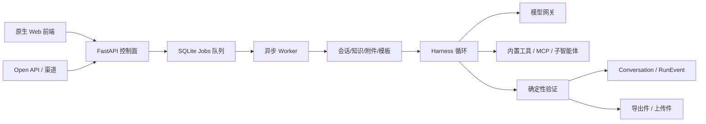

# 架构安全审计与修复记录

## 2026-07-31 复审结论

本文件原审计列出的安全、隔离、一致性、生命周期、认证、扩展性与运维问题已完成修复。公共智能体高危工具、工作区隔离、一次性批准、执行快照、队列租约/幂等、产物生命周期、浏览器网络隔离、凭据加密、JWT 撤销、版本化迁移、依赖锁、提示注入边界、自动改进门禁、Open API 统一队列、资源治理、Cookie/CSP、共享限流/渠道去重及跨进程流式状态均已落地并有持续回归。

实际 SQLite 已先备份再升级至 `0007_persist_partial_stream`：`integrity_check=ok`、外键问题 0，现有敏感字段明文计数 0。全量 99/99 测试在 `ResourceWarning` 严格模式通过，后端/迁移编译、全部前端 JavaScript 语法、`pip check`、Alembic 单一 head 与锁文件哈希解析均通过。

以下“主要盲点”保留为修复前问题背景；权威完成状态以“修复进度”为准。

修复前审计结论：项目主链路清晰、当时测试全部通过，但不适合直接作为多用户生产智能体平台。最大问题不是普通代码缺陷，而是“模型工具权限＝服务账号权限”，缺少真正的用户确认、租户隔离与执行沙箱。

## 当前架构与执行逻辑

正常 Web 对话流程 melt：

1. `/api/v1/chat` 校验用户、智能体、资源和附件。
2. 将任务写入 `jobs`，立即返回 `job_id`。
3. Worker 原子领取任务，加载历史对话。
4. 解析模型、知识库、Skill、MCP、子智能体和内置工具。
5. Harness 执行“规划—工具—观察—验证”循环。
6. 保存会话、任务结果和运行事件，通过进程内流或数据库轮询返回。

例外是 `/open/v1/chat`：它直接同步运行 Harness，绕过队列、并发控制、取消与 Run 事件体系。

## 主要盲点

### P0：公共智能体具备共享工作区读写和命令执行能力

工作区默认就是项目根目录，包含 `.env`、SQLite、源码和数据：[config.py (line 15)](/D:/SOFTWARE/AppData/Desktop/agent/backend/config.py:15)。

初始公共默认智能体会自动绑定全部内置工具：[main.py (line 558)](/D:/SOFTWARE/AppData/Desktop/agent/backend/main.py:558)。当前数据库中该智能体确实绑定了全部 35 项工具，包括 `read`、`write`、`edit`、`shell` 和 `git_commit`。

因此任意已登录普通用户理论上可以诱导智能体：

- 读取 `.env` 中的密钥；
- 修改服务源码或配置；
- 写入 Python 脚本后通过 Shell 执行；
- 操作所有用户共用的工作区。

所谓 `confirm=true` 只是模型生成的参数检查，并不代表用户真实确认：[builtin_tools.py (line 453)](/D:/SOFTWARE/AppData/Desktop/agent/backend/runtime/builtin_tools.py:453)。这不能防御提示注入或模型误操作。

### P0：不可信附件和知识内容被提升到 system 上下文

知识库、附件、模板正文直接拼接进 system message：[orchestrator.py (line 233)](/D:/SOFTWARE/AppData/Desktop/agent/backend/runtime/orchestrator.py:233)。恶意文档中的提示注入因此与系统指令同层，并可进一步调用上述高权限工具。

这是“提示注入 → 读取密钥/修改文件/执行命令”的完整攻击链。

### P1：记录的 Harness 版本不是实际执行版本

入队时保存了 `harness_version`：[chat.py (line 870)](/D:/SOFTWARE/AppData/Desktop/agent/backend/api/chat.py:870)；但真正执行时重新读取智能体当前活动版本：[chat.py (line 569)](/D:/SOFTWARE/AppData/Desktop/agent/backend/api/chat.py:569)。

任务排队期间若发布新版本：

- Run 显示执行了旧版本；
- 实际使用新版本；
- 回放、评估、审计和回滚结论均不可信。

Skill、MCP、工具绑定和模型路由也主要在执行时重新解析，不是完整快照。

### P1：浏览器并非真正隔离

浏览器使用固定的 `data/browser_profile_runtime`，而不是每个 Run 的临时配置：[browser_cdp.py (line 115)](/D:/SOFTWARE/AppData/Desktop/agent/backend/runtime/browser_cdp.py:115)。

风险包括：

- Cookie、站点数据和缓存跨用户、跨 Run 残留；
- 全局只允许一个浏览器会话，任务互相阻塞；
- 初始 URL 虽检查 SSRF，但页面重定向、脚本导航和子资源访问不受同等控制；
- `browser_click` 无确认门禁，但点击本身可能产生提交、删除或购买等副作用。

MCP 客户端也只校验初始 URL，却启用了自动重定向，存在相似的重定向 SSRF 缺口。

### P1：任务队列不是严格幂等执行

任务终态写入没有校验当前 worker、租约或状态：[jobs.py (line 334)](/D:/SOFTWARE/AppData/Desktop/agent/backend/jobs.py:334)。陈旧 Worker 与重新领取 Worker 竞争时，旧 Worker 可能覆盖新结果。

其他问题：

- 没有 `attempt_count`、最大重试和死信队列；
- 没有幂等键，重入会重复执行写文件、Cron、MCP 等副作用；
- RunEvent 使用 `count()+1` 生成序号，且无唯一约束，并发下可能重复；
- 多个 Scheduler 副本可重复派发同一 Cron；
- 同一会话并发提交没有串行化，两个回答可能基于相同旧历史。

### P1：运行证据和产物生命周期断裂

当前数据库实测：

- `jobs`：0 条；
- `run_events`：826 条。

任务清理会删除 Job，却不删除或归档 RunEvent；RunEvent 又没有 Job 外键：[models.py (line 388)](/D:/SOFTWARE/AppData/Desktop/agent/backend/models.py:388)。结果是事件长期占库，但改进实验室因 Job 已不存在而无法访问。

导出目录目前有 2 个文件，均未被任何会话引用。内置 HTML、图片和浏览器截图会返回下载地址，但不会加入 `Conversation.export_files`，随后又会被下载鉴权拒绝。即“生成成功但无法下载”，同时文件永久残留。

### P1：改进门禁属于自报结果

评估接口直接接受调用者提交的 `{"outcome":"passed"}`，同一管理员可创建、标记通过并批准：[improvement.py (line 167)](/D:/SOFTWARE/AppData/Desktop/agent/backend/api/improvement.py:167)。

没有：

- 自动回归任务或结果签名；
- 基线/候选指标核验；
- 创建人与审批人职责分离；
- 检查 `base_version` 是否已过期。

因此它是流程状态机，不是真正质量门禁。

### P1：凭据仍明文存储

模型 API Key、OAuth refresh token、MCP headers、渠道 token/AppSecret 都以明文存入 SQLite：[models.py (line 64)](/D:/SOFTWARE/AppData/Desktop/agent/backend/models.py:64)。数据库、备份或工作区读取权限泄露后，上游凭据会整体暴露。

### P2：认证、扩展性与运维盲点

- JWT 默认有效 12 小时，无 `jti`、令牌版本或密码修改后撤销机制。
- JWT 存于 `localStorage`，CSP 仍允许内联脚本。
- 流接口只解 JWT，不重新检查账号是否已禁用：[chat.py (line 952)](/D:/SOFTWARE/AppData/Desktop/agent/backend/api/chat.py:952)。
- Open API 同步执行并长期持有数据库会话：[open_api.py (line 43)](/D:/SOFTWARE/AppData/Desktop/agent/backend/api/open_api.py:43)。
- 限流、流事件、部分答案、渠道去重和浏览器会话均为进程内状态。
- 无用户级并发、Token/费用配额、队列上限或公平调度；单一用户可占满四个 Worker。
- `/healthz` 只返回固定 JSON，不检查数据库、Worker、队列积压或模型状态。
- 手写启动迁移会在应用启动时执行删表/重建，缺少迁移版本、回滚和多副本互斥。
- `requirements.txt` 仅使用 `>=`，无锁文件，构建不可复现。
- 当前目录不是 Git 仓库，也没有 `.gitignore`；`.env`、数据库、备份、缓存均位于项目树。

## 工程质量验证

- 71/71 单元测试通过，但出现未关闭 SQLite 连接的 `ResourceWarning`。
- Python `compileall` 通过。
- 三个前端 JS 文件语法检查通过。
- `pip check` 无依赖冲突。
- SQLite `integrity_check=ok`，外键问题为 0。
- OpenAPI：87 个路径、117 个操作。
- 历史报告引用的 `test_security_regressions.py`、`smoke_test.py` 等源码已不存在，仅有过期缓存；历史“已修复”安全结论缺少持续回归保障。
- 当前 root 数据库密码已修改，并非默认口令；JWT 长度与配置正常。
- 本轮未修改代码或数据。

## 建议修复顺序

### 修复进度

- [已完成] 1. 关闭公共智能体的读写、Shell、Git、浏览器写操作；将工作区迁出项目根目录。（安全回归 2/2 通过）
- [已完成] 2. 建立每用户/每 Run 独立工作区、敏感路径拒绝规则和 OS 级低权限沙箱。（隔离回归 3/3 通过）
- [已完成] 3. 将 `confirm=true` 改成服务端签发、用户点击产生的一次性批准令牌。（令牌回归、编译与前端语法检查通过）
- [已完成] 4. Worker 严格按入队版本 ID 加载完整 Harness/能力快照。（快照与 Harness 回归通过）
- [已完成] 5. 修复任务租约、幂等键、重试计数、事件唯一约束和 Cron 领取事务。（队列一致性回归 2/2 通过）
- [已完成] 6. 建立 Artifact 表和统一生命周期；修复 RunEvent 保留策略。（产物生命周期回归通过）
- [已完成] 7. 浏览器改为一次性临时 Profile，并对每次导航执行网络级出站控制。（持续请求拦截、Run 结束强制清理与 MCP 重定向回归 4/4 通过）
- [已完成] 8. 引入 Secret Manager/信封加密、JWT 撤销版本、Alembic、依赖锁和安全回归 CI。（专项安全回归 18/18、锁文件哈希解析、工作流/前端语法及 pip check 通过）
- [已完成] 9. 将知识库、附件、记忆与模板正文降为 user 层非可信 JSON 数据，压缩摘要不再提升为 system。（提示注入边界回归 2/2 通过）
- [已完成] 10. 将改进门禁改为基线/候选配对 Run 自动评估、HMAC 结果签名、过期基线拒绝和创建/审批职责分离。（门禁与迁移回归 2/2 通过）
- [已完成] 11. Open API 改为统一入队执行，复用能力快照、幂等、并发/取消与 RunEvent；同步窗口超时后返回可轮询 job_id。（队列链路回归 1/1 通过）
- [已完成] 12. 增加用户/全局任务上限、按用户占用公平领取、跨进程 Worker 心跳和数据库/迁移/队列真实健康检查。（资源治理回归 3/3 通过）
- [已完成] 13. Web JWT 迁移至 HttpOnly/SameSite/Secure Cookie，保留 Bearer API；清除 localStorage JWT、内联脚本/事件和 CSP `unsafe-inline` 脚本许可。（认证/CSP 回归 2/2 通过）
- [已完成] 14. 将应用限流计数与微信公众号消息去重/推送领取迁入共享数据库，消除多 API 副本的进程内状态分叉。（共享状态与迁移回归 2/2 通过）
- [已完成] 15. 将流式部分答案按时间/字符阈值批量写入 Job，独立 Worker 与 API 分进程时可持续读取，终态自动清理。（跨进程流回归 2/2 通过）
- [已完成] 16. 对实际数据库执行一致性备份、Alembic 升级与历史凭据加密；归档旧固定浏览器 Profile，并初始化受 `.gitignore` 保护的本地 Git 仓库。（完整性、外键、密文与版本检查通过）
- [已完成] 17. 修复 GPT-OSS/NVIDIA 以 HTTP 200 返回 Harmony 工具头解析错误时绕过重试的问题；仅对已识别的工具协议错误有限重试，并降低 GPT-OSS 工具决策温度。（故障精确复现、对话运行时 37/37、全量 99/99 回归通过）

1. 立即关闭公共智能体的读写、Shell、Git、浏览器写操作；将工作区迁出项目根目录。
2. 建立每用户/每 Run 独立工作区、敏感路径拒绝规则和 OS 级低权限沙箱。
3. 将 `confirm=true` 改成服务端签发、用户点击产生的一次性批准令牌。
4. Worker 严格按入队版本 ID 加载完整 Harness/能力快照。
5. 修复任务租约、幂等键、重试计数、事件唯一约束和 Cron 领取事务。
6. 建立 Artifact 表和统一生命周期；修复 RunEvent 保留策略。
7. 浏览器改为一次性临时 Profile，并对每次导航执行网络级出站控制。
8. 引入 Secret Manager/信封加密、JWT 撤销版本、Alembic、依赖锁和安全回归 CI。
