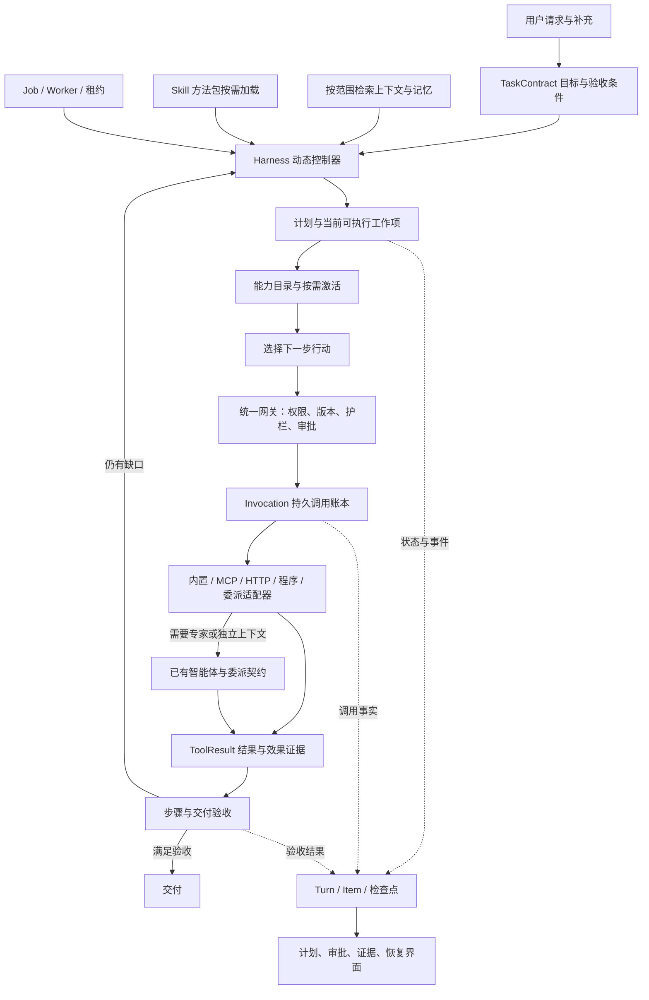

# 按需智能体架构与工具编排方案

状态：设计方案，尚未实施本方案中的运行时改造。  
基线：2026-09-13 当前工作区，包括已有服务、MCP stdio、四类记忆、命名护栏与结构化工具契约。  
目标：让同一个智能体根据当前目标、可用资源、执行结果和剩余预算调整工作方式，并在审批、失败或进程中断后可靠继续。

## 1. 核心决策

保留现有 FastAPI、Harness、Worker 和 `Project → Thread → Turn → Item`。在现有执行器之上形成四个清晰边界：**任务契约、动态计划、统一能力网关、可恢复的调用账本**。

“按需”具体指：

1. 简单问题可以直接回答，不强制建立多步计划、启动 MCP 或调用子智能体。
2. 有外部数据或操作需求时，先从已授权目录发现能力，再加载必要的 Schema、Skill 和上下文。
3. 根据新观察、用户补充、验收缺口或能力故障，修改尚未完成的步骤，保留已发生的事实。
4. 独立的只读工作可以并行，存在依赖或共享写入的操作由调度器排序。
5. 工作需要专家能力、独立上下文或并行研究时，才委派已有智能体。
6. 所有调整都受当前用户授权、任务范围、预算、审批和护栏约束。

本轮设计不指定新模型供应商、模型名称或框架，不自动安装能力，不改变生产部署。附带教材中的产品与模型示例只作为参考内容；当前代码是现状判断依据。

## 2. 当前能力与需要调整的地方

| 已有实现 | 当前限制 | 本方案调整 |
|---|---|---|
| 动态 Agent Loop、工具候选路由 | 路由主要用原始 query 和最近观察进行词项匹配，追加引导没有进入统一目标状态 | 每轮使用更新后的 TaskContract、当前工作项和证据缺口路由 |
| 有稳定步骤 ID、revision 和计划事件 | 事件可回放，但运行计划主要在进程内；步骤完成仍主要来自模型声明 | 计划成为可恢复工作项，完成必须关联验收证据 |
| ToolCatalog 授权目录 | 内置、MCP、服务的目录粒度不同；Skill 正文全量注入 | 统一能力描述，分开“发现、激活、执行” |
| 服务创建与运行、MCP 三种传输 | 服务定义实时读取，MCP 配置进入快照；版本与审批关联不一致 | 调用固定具体能力版本，执行前复核撤权与版本 |
| Job 租约、审批、重试、取消 | 恢复主要重新进入 execute_chat；内存缓存不能证明外部动作已经执行 | 持久化 Invocation、结果、效果状态和恢复检查点 |
| 完成验证与评估树 | 计划状态、工具名、字数或产物存在无法独立证明任务验收通过 | 验收断言绑定证据；缺口可以回到有限的实际修复 |
| 子智能体与深度限制 | 同步和后台委派的上下文、预算、能力收窄契约不统一 | 统一 DelegationContract，与父任务共用预算账本 |
| 四类记忆与账户隔离 | 旧历史召回策略仍是 agent/user，缺少四类独立读取策略 | 分层读取策略，写入采用候选、冲突处理和明确保存规则 |

已有代码证据：

- [执行快照与请求入口](C:/Users/fuetsui/Desktop/agent/backend/api/chat.py:837)、[Worker 恢复入口](C:/Users/fuetsui/Desktop/agent/backend/worker.py:329)。
- [目录初始化](C:/Users/fuetsui/Desktop/agent/backend/runtime/orchestrator.py:660)、[候选路由](C:/Users/fuetsui/Desktop/agent/backend/runtime/control.py:179)、[运行中引导](C:/Users/fuetsui/Desktop/agent/backend/runtime/orchestrator.py:756)。
- [当前计划更新](C:/Users/fuetsui/Desktop/agent/backend/runtime/orchestrator.py:887)、[循环检查点](C:/Users/fuetsui/Desktop/agent/backend/runtime/loop.py:13)、[Job 重试](C:/Users/fuetsui/Desktop/agent/backend/jobs.py:1627)。
- [工具契约](C:/Users/fuetsui/Desktop/agent/backend/runtime/tool_contracts.py:11)、[服务执行](C:/Users/fuetsui/Desktop/agent/backend/custom_services.py:144)、[审批令牌](C:/Users/fuetsui/Desktop/agent/backend/approvals.py:41)。
- [子智能体执行](C:/Users/fuetsui/Desktop/agent/backend/runtime/orchestrator.py:269)、[记忆范围](C:/Users/fuetsui/Desktop/agent/backend/memory_store.py:52)、[运行策略](C:/Users/fuetsui/Desktop/agent/backend/runtime/policies.py:54)、[当前评估](C:/Users/fuetsui/Desktop/agent/backend/runtime/evaluation.py:168)。

## 3. 目标架构



图中的回路描述运行能力，不是要求每个请求顺序通过所有节点的固定业务流程。一个问题可以直接完成；复杂任务可以多次观察和重规划。

### 3.1 职责与建议代码组织

以下新增文件名是实施建议，不代表文件已存在。

| 组件 | 负责什么 | 建议落点 |
|---|---|---|
| TaskContract | 当前目标、约束、交付物、验收项、授权范围和目标 revision | `runtime/task_contract.py` |
| PlanController | 工作项依赖、激活条件、变更原因和证据状态 | `runtime/planning.py` |
| CapabilityRegistry | 稳定 ID、能力元数据、版本、Schema 引用、健康与可用性 | 扩展 `runtime/tool_contracts.py` |
| CapabilityResolver | 在授权上限内检索、加载 Skill/Schema、发现依赖缺口 | `runtime/capability_resolver.py` |
| ContextAssembler | 按当前工作项组装请求、材料、观察和分层记忆 | `runtime/context.py`，复用 `runtime/memory.py` |
| ToolGateway | 执行前复核、审批和统一结果适配 | `runtime/tool_gateway.py` |
| InvocationLedger | 调用状态、参数指纹、效果、幂等和恢复 | `runtime/invocations.py` + 数据库表 |
| ActionScheduler | 依赖调度、共享预算、并发、资源锁和取消 | `runtime/action_scheduler.py` |
| Evaluator | 检查验收项与证据，返回可执行的修复缺口 | 扩展 `runtime/evaluation.py` |
| Orchestrator | 连接以上组件，负责循环和状态转换 | 逐步精简现有 `runtime/orchestrator.py` |

现有 MCP、网络服务、编程服务和内置工具执行器继续保留。网关适配它们的输入输出，逐步替换重复控制逻辑。

## 4. 任务与动态计划

### 4.1 TaskContract

必须区分用户明确要求、从材料中提取的事实和模型提出的假设。

| 字段 | 含义 |
|---|---|
| `objective` / `objective_revision` | 当前目标及版本；原始请求保留 |
| `deliverables` | 需要交付的回答、文件或外部变更 |
| `acceptance_criteria` | 可检查条件、所需证据类型、必需或可选 |
| `constraints` | 用户指定的数据范围、格式、时限与禁止操作 |
| `assumptions` | 尚未证实且会影响执行的假设 |
| `authority_snapshot_id` | 当前任务已获授权的能力及资源上限 |
| `budget_id` | 父子任务共同核算的预算 |
| `context_refs` | 附件、项目、会话与事实来源的引用，不复制全部正文 |

模型可以提出契约草案，但不能自行删除用户指定的交付物、放宽约束或把材料中的指令升级为用户授权。明显、低影响的实现细节可由智能体决定；缺少阻塞输入时只提出所需问题，同时继续独立工作。

### 4.2 工作项

沿用已有 `step_id` 和计划事件，在展示步骤之下增加执行字段：

```text
WorkItem = {
  id, objective_revision, description,
  depends_on[], input_refs[], required_capabilities[],
  expected_outputs[], acceptance_criteria[],
  owner_agent_id, status, evidence_refs[],
  attempt_count, budget_reservation_id
}
```

工作项状态建议为 `pending / ready / running / waiting / completed / failed / skipped`。`waiting` 附带审批、用户输入、外部任务或资源锁原因。这些是内部工作项状态，不直接替换当前 Turn/Job 的全部状态枚举。

计划更新使用持久 revision 做条件写入，并追加 `plan.updated`。稳定 ID 不依赖标题相似度猜测；模型提交现有 ID 或申请新 ID，由控制器校验。完成步骤必须指向已接受的证据，模型的 `completed` 只是完成申请。

### 4.3 何时调整计划

| 触发 | 允许的调整 | 必须保留 |
|---|---|---|
| 用户补充约束或改变交付物 | 更新目标 revision，标出受影响步骤，重新检查能力和验收 | 原要求、新消息和已经发生的操作 |
| 工具不可用 | 切换授权范围内且满足相同契约的替代能力 | 原失败及替换原因 |
| 观察与假设冲突 | 修正假设，失效依赖该假设的后续步骤 | 原观察与来源 |
| 验收缺证据 | 创建补证据或修复工作项 | 未通过的验收项 |
| 预算不足 | 缩小可选工作、请求增加预算或给出受限结果 | 必需交付项不能悄悄取消 |
| 重复操作无进展 | 改变策略或停止该路径 | 重复原因及已耗预算 |

兼容现有引导机制：当前 Turn 的补充进入同一契约的后续 revision；明确切换目标的操作继续创建关联后继 Turn。后继任务重新解析目标需求与能力授权，不能只替换 query 然后无条件使用旧快照。

## 5. 五类能力的统一管理与按需加载

### 5.1 管理分类与执行类型

| 管理分类 | 运行时含义 | 激活方式 |
|---|---|---|
| 内置工具 | 进程内或平台提供的确定性操作 | 加载所需工具 Schema，经统一网关执行 |
| MCP | 一个服务下的多个远端操作，传输为 HTTP/SSE/stdio | 先读受权元数据，需要时连接、发现和校验目录 |
| Skill | 方法、指令、资源以及可选能力依赖 | 先读名称与触发说明，命中后载入正文；本身不是 RPC |
| 自定义网络服务 | 已注册接口中的一个具体业务操作 | 每个服务生成独立能力条目和真实输入 Schema |
| 编程服务 | 已注册本地程序的固定调用契约 | 每个程序生成独立能力条目；不接收模型任意命令 |

MCP 与服务使用相同的操作粒度。现有 `service_list/service_call` 作为兼容入口保留，但内部解析到同一个具体能力和 Invocation，不能形成绕过新网关的第二条执行路径。

### 5.2 CapabilityDescriptor

```text
CapabilityDescriptor = {
  id, revision, kind, name, description, capability_tags[],
  input_schema_ref, output_schema_ref,
  resource_binding, executor_ref,
  effects, idempotency, concurrency_keys[],
  timeout_limit, health, provenance
}
```

- 稳定 ID 区分内置操作、MCP 服务/工具、网络服务、程序服务和 Skill。模型可调用别名由平台生成并唯一映射，不能按显示名称直接分派。
- 元数据声明与平台验证分开记录。`unknown` 副作用不能默认为只读，HTTP GET 也不能单独证明无副作用。
- 目录只有当前账户和任务可发现的资源，不泄露其他账户的服务名称、主机、目录或 Schema。
- 凭据只保存在后端加密配置或引用中；不进入模型目录、审批摘要或公开事件。
- MCP 目录变化必须检查新增/删除操作、Schema 和风险变化。旧审批不能授权改变后的操作。

### 5.3 发现 → 激活 → 执行

1. 建立当前任务可发现目录，优先读取已校验的目录缓存；不为一个普通问答启动全部 stdio 进程。
2. 用当前目标、工作项、输入类型、交付类型和缺失证据筛选能力；健康与预算作为可用性约束。
3. 先加载少量候选的完整 Schema，以及当前需要的 Skill 正文。
4. 没有合适候选时，可以扩大已授权目录的检索；记录原因和上限，不能因为检索未命中而宣称能力不存在。
5. 解析 Skill 的能力依赖。依赖不可用时，保留该方法的缺口或采用其他已授权方法，不随 Skill 自动授予工具权限。
6. 模型提出调用意图；执行资格由网关决定，不能把候选得分当作授权。

候选数量、缓存有效期和检索策略由离线任务集评估后确定。先保留现有词项路由作为候选信号，增加输入类型、能力标签、当前计划和观察信号；只在歧义较高时增加语义选择，避免每次动作都多调用一个规划模型。

## 6. 调用、审批与可靠恢复

### 6.1 单一执行入口

每个可执行能力都遵循：

```text
解析稳定能力ID
→ 复核用户、Agent、任务授权和即时撤权
→ 固定能力/资源版本并校验输入
→ 计算调用指纹，写入调用意图
→ 检查护栏与审批
→ 原子领取调用和预留预算
→ 执行适配器
→ 保存结果/效果状态并校验输出
→ 内容护栏
→ 产生可见观察和证据
```

业务调用、控制工具、子智能体调用及缓存结果都应经过适用的同一组边界。公开参数摘要必须在输入护栏检查后生成；原始输出不能先进入公开事件再检查。

### 6.2 Invocation 与审批

建议新增 `tool_invocations` 表，至少包含：

`invocation_id、turn_id、step_id、agent_id、capability_id/revision、args_digest、encrypted_args_ref、status、effects_status、attempt、idempotency_key、result_ref、approval_ref、lease_owner、fencing_token、created_at/updated_at`。

审批绑定不可变 Invocation，校验用户、任务、实际 Agent、操作、规范化参数指纹及资源/Schema 版本。摘要可脱敏，但指纹必须覆盖完整实参和实际目标。规范化算法版本、类型、空值、缺省值与字段排序固定，凭据字段采用后端安全指纹，不暴露明文。

同一个 Invocation 恢复时可以继续等待原审批；参数、目标、版本或效果范围变化必须产生新 Invocation 并重新评估审批。不能拿“批准调用该工具”替代“批准这一次具体动作”。

批准 API 与界面同步携带 `invocation_id + expected_revision`，后端核对已保存指纹和实际执行者，再条件更新审批状态。Job ID 只用于定位任务，不能代表用户确认的具体动作；界面按 Invocation 标识呈现及去重，陈旧面板提交必须拒绝并刷新动作摘要。这一最小改造属于 P0，不能等完整界面重设计后再补。

### 6.3 冻结与实时变化

| 规则 | 本轮处理 |
|---|---|
| 用户、交付范围、预算上限、执行偏好 | 固化版本；用户追加修改形成新版本 |
| 允许使用的资源及可委派资源上限 | 固化授权快照；新增授权需认证用户的明确变更与新快照 |
| 用户停用、Agent 撤销、能力全局关闭、资源撤权 | 每次实际分派复核，立即缩小可执行集合 |
| 服务命令、URL、参数 Schema、风险变化 | 不静默替换已审批调用的配置；重新固定版本与评估 |
| 护栏规则 | 记录所用 revision；同次模型调用使用一致的输入/输出快照；紧急撤销由执行资格层阻断后续分派 |

“动态调整”允许在已授权上限内改变候选、模型路由和计划，不允许模型修改权限、提高硬预算或关闭护栏。已开始的外部操作能否取消取决于执行器；变更规则不能制造“已撤销副作用”的假象。

### 6.4 ToolResult

```text
ToolResult = {
  invocation_id, status: success | partial | failed,
  data_ref, summary,
  error: {category, code, retryable},
  effects: {state: none | confirmed | unknown, receipt_ref},
  artifacts[], evidence_refs[], usage,
  output_validation, provenance
}
```

适配器负责协议层归一化；输出 Schema 校验与业务验收分别记录。合法 JSON、HTTP 200、MCP 正常返回和任务成功不是同一个条件。缓存复用引用原 Invocation 和观察时间，不新增一次成功执行证据。

### 6.5 恢复状态

| 中断时状态 | 恢复动作 |
|---|---|
| 已保存意图，尚未分派 | 重新复核执行资格、版本、预算后领取 |
| 等待审批 | 恢复同一 Invocation 的审批面板 |
| 已确认完成，结果已持久化 | 验证结果可用性及撤权/护栏，复用结果，跳过原动作 |
| 外部调用已发出，但无完整结果 | 标记效果未知，优先查询回执/幂等记录；无法确认则暂停该副作用路径 |
| 纯读取或执行器明确保证可安全重试 | 在剩余预算内有界退避；缓存需考虑数据时效 |
| 工具输出已完成但验收不通过 | 新建对应修复工作项，不改写原调用事实 |

数据库状态与外部服务写入无法普遍组成一个事务，因此不承诺所有工具“恰好执行一次”。可做到的是持久意图、稳定幂等键、效果探测、禁止对未知副作用盲重放以及单次领取。

检查点保存目标/计划 revision、可重建的上下文引用、已确认观察、预算、等待中的 Invocation 与子任务 ID。公开 Item 不保存私有推理；必要的内部执行材料加密保存并控制访问。Job 再领取时进入 `resume(checkpoint)`，不默认从任务起点重新执行。

在完整检查点上线之前，P0 也必须拦截旧 `execute_chat` 自动重入：模型提出的动作批次与稳定调用 ID 先持久化，再允许分派。恢复按这个记录继续，不能重新推理后为同一未确认写操作生成新 ID。若旧任务没有可靠的调用身份和恢复位置，则停止自动重放，进入待核查；仅凭相同参数去重也不可靠，因为用户可能确实要求重复操作。

## 7. 按需模式与下一步决策

用户侧提供“自动、直接处理、分步处理”三种处理偏好，默认自动；“允许协作”作为独立开关，仍受已配置委派权限约束。直接处理减少公开计划与额外规划调用，不能省略任务所需的工具、审批和验收；偏好只能在可用能力、预算与授权内生效。

| 当前情况 | 调度方式 |
|---|---|
| 不需外部证据的简单问答 | 直接模型回答及必要的输出检查 |
| 一个明确操作 | 单次能力调用和结果验收，可省略公开多步计划 |
| 有依赖的多步目标 | 动态计划 + 单 Agent 循环 |
| 多个输入独立、可安全并行的步骤 | 同一 Agent 下并发工具调用，统一汇合结果 |
| 明确专家能力或需要隔离上下文 | 委派已配置智能体，验证返回结果后纳入父任务 |
| 输入缺失、等待审批、外部任务执行中 | 持久化等待条件并释放执行槽；继续其他就绪工作 |

伪代码：

```python
while not task.is_terminal:
    apply_user_updates_with_revision()
    reconcile_inflight_calls_and_children()
    reevaluate_changed_constraints_and_permissions()
    if needs_replanning():
        plan = revise_plan(task, observations, remaining_budget)
    gaps = evaluate_acceptance(task, plan, evidence)
    if not gaps.required:
        cancel_undispatched_optional_work()
        if not terminal_gate_settled(invocations, children, effects):
            return persist_wait_or_explicit_unresolved_result()
        return finalize_after_output_guardrail()
    ready = plan.ready_items()
    if not ready:
        return persist_wait_or_bounded_incomplete_result()
    context = assemble_context(task, ready, observations, memory_policy)
    candidates = resolve_authorized_capabilities(ready, context)
    actions = decide_next_actions(ready, candidates, context)
    dispatch_only_dependency_safe_actions(actions, shared_budget)
    persist_checkpoint()
```

实际实现必须对每个预算、错误与状态转换做确定性校验，不能依赖模型自报“还有预算”或“步骤已完成”。

任务终态门禁同时检查交付验收、已分派调用、子任务以及未知副作用。仍在运行的后台写操作不能因报告生成完毕就被忽略；能取消的先取消并核对结果，不能收敛的明确记录待核查或未完成。对用户交付部分结果可以结束一次回复，但不能将任务标为全部成功或悄悄放任后续操作。

### 7.1 模型职责与按需切换

规划、行动和验收是职责，不要求三个独立模型或三个常驻智能体。默认由现有主模型完成行动选择，简单任务一次回答即可；计划有明显依赖、连续失败或验收缺口时才增加规划工作。

| 职责 | 默认方式 | 需要调整时 |
|---|---|---|
| 意图与计划 | 主模型结合当前契约处理 | 复杂依赖或无进展时，选择已有且获准的规划模型 |
| 下一步行动 | 主模型只看到当前候选和必要上下文 | 输入模态、上下文容量或工具调用能力不满足时，路由到兼容的已配置模型 |
| 参数与状态校验 | Schema、权限、预算和状态机确定性处理 | 参数确有歧义时有限请求模型修复；不得借修复改变已批准的调用 |
| 交付验收 | 先运行文件、数据、格式等可执行检查 | 无法确定性判断的质量项可用已配置评估模型，保留证据与不确定性 |

切换记录原因、模型配置版本和预算影响，不改变能力授权。服务故障可以选择兼容备用模型；护栏拒绝不能触发更宽松模型回退。验收模型的判断不能替代原始事实、真实工具效果或用户验收条件。

## 8. 并发与子智能体

### 8.1 并发

当前 `max_parallel_calls` 应拆为“单次模型提出的动作数”和“实际并发数”，避免界面配置与执行语义混淆。

只有依赖已满足、输入独立、资源访问不冲突、预算预留成功的操作才可并行。只读声明无法验证或副作用未知时按保守策略调度。资源键至少覆盖工作区路径、服务业务对象、共享会话和程序实例；相同文件的写入与读取必须考虑先后关系。

调度器使用租约和 fencing token 防止旧 Worker 继续提交结果；预算预留、领取和状态转换使用短事务，不在持有数据库写锁时等待网络。取消级联到当前任务的后代与可取消执行器，并记录未能撤销的外部效果。

根任务建立唯一预算账户，所有模型调用（包括规划、路由、摘要、验收）、工具尝试和子任务都先预留再结算。失败与重试仍记入实际消耗；契约修订、计划修订或进程恢复不能重置余额。无法预先确定费用的执行器需有可执行上限或保守预留；计费回执不完整时保留待结算记录，不能直接返还全部预算。共享预算在开放并发前就必须有效。

### 8.2 DelegationContract

委派对象来自现有智能体，临时角色只改变任务说明和上下文，不自动创建永久 Agent 或发布 Harness。

契约包含：目标、父工作项、允许的能力/资源、输入材料、读取记忆范围、交付 Schema、验收条件、预算份额、期限、取消关系和允许再委派的深度。

专家可以拥有父 Agent 没有直接挂载的工具，但必须同时满足：

```text
用户可使用的专家资源
∩ 父任务声明允许委派的资源包
∩ 专家 Harness 的能力上限
∩ 本次 DelegationContract 的收窄范围
∩ 当前未被撤销的执行资格
```

同步和后台委派共用该契约、结果信封和预算账本。父任务不能仅根据子任务的自然语言总结标记完成；必须接受具体输出与证据。父任务恢复时复用子任务 ID 和已有结果，不能重新无条件 spawn。

## 9. 上下文、记忆与护栏协同

### 9.1 上下文装配

优先序：用户当前目标与硬约束 → 当前会话的有效补充 → 当前工作项所需材料与已验证观察 → 相关记忆。来源材料、工具内容和记忆始终附来源/可信度，不作为新的系统授权。

采用引用、摘要和需要时回读原文控制上下文体积；验收相关事实必须保留可追溯来源。模型能力决定可用上下文和输出预算，具体模型从已有 Provider 及模型路由配置中选择，禁止按示例名称硬编码。

### 9.2 四类记忆

| 范围 | 读取边界 | 建议用途 |
|---|---|---|
| 用户自定义 | 当前账户 + 指定智能体 | 专项偏好和手动维护事实 |
| 上下文 | 当前账户拥有的会话 | 会话内持续约束、确认事项 |
| 项目 | 当前账户拥有的项目 | 术语、背景、项目决策 |
| 全局 | 当前账户跨项目/会话 | 通用个人偏好；不等于跨用户共享 |

每类分别设置 `enabled、budget、relevance_threshold、expiry_policy`。先保留现有 Agent/Thread 开关及排除规则，再允许任务进一步收窄；子智能体只收到契约允许的记忆范围或片段。

读取和写入独立配置。默认保留手动记忆维护；自动提取先进入候选区，附来源、范围、时间与冲突关系。未经有效保存策略或用户确认，不把模型假设和外部材料中的指令长期写入。记忆修订需要 CAS/revision，删除或失效记录不得被旧缓存重新激活。

### 9.3 护栏

保留现有用户输入、工具输入、工具输出、模型输出干预点。计划修改、能力激活、委派和最终交付都引用实际生效的策略版本。无检测器的语义类别继续保持不可用，不把关键词规则包装为语义安全保证。

护栏阻止属于执行约束，不作为网络故障尝试更弱策略或另一个未受约束模型；验证失败才进入合规修复。工具输出被阻止时，已产生的副作用仍写入账本。

## 10. 管理端与用户端交互

### 管理端

- **智能体配置**：已有模型、备用模型、工具、Skill、记忆和护栏继续可选；新增编排偏好、任务预算上限、可委派智能体及资源包、验收规则。
- **工具与服务**：保留五类分类；详情统一显示输入/输出契约、版本、效果声明、健康、绑定对象、调用记录和审批要求。
- **Skill**：展示触发说明、正文、依赖能力、加载方式和版本，提供“依赖可用性检查”。
- **记忆**：四范围管理与读取策略分别设置；自动记忆候选进入单独待确认列表。
- **护栏**：使用现有命名策略绑定；编排层显示本次哪些策略生效及其版本。
- **成员与权限**：从现有模块/资源中选择；模块可见性、资源使用权、实际工具授权分别校验。

### 用户端

任务开始只显示必要状态；确有多步工作再展开计划。展示当前目标、步骤、输入或审批需求、可核对的证据和交付物，不展示模型私有推理。

当计划变化时显示“变化了什么、原因、影响哪些待完成项”，避免整个计划闪烁重建。审批面板显示这一次动作的资源、效果预览、重要参数和版本；修改后原审批失效应明确提示。

断线重连恢复同一个任务、工作项和待审批动作。用户的“继续”表示继续未完成工作，“重试失败步骤”只重试该步骤的安全恢复路径，“重新开始”才创建新的执行范围。

## 11. 示例：整理项目资料并生成报告

1. 任务契约记录报告格式、引用要求、允许联网的范围以及输出位置。
2. 先查看已有附件和相关项目记忆；不因存在 MCP 绑定就启动全部服务。
3. 激活所需报告 Skill，检查它的读取、计算和导出依赖是否已授权。
4. 独立资料读取可以并行；出现数值缺口时才激活已注册编程服务；需要时效核验时才选授权网络能力。
5. 如用户追加“只使用内部材料”，更新目标 revision，停止未分派的联网步骤；已发生联网查询保留历史，不能回写成没有发生。
6. 计算通过不代表报告完成。验证数据来源、计算结果、文件结构和用户要求，再将对应工作项标为完成。
7. 审批或重启发生在导出之后，恢复时复用已确认的文件及其哈希；验证失败才创建针对性的修订调用。

## 12. 分期实施与迁移

| 顺序 | 交付 | 验收后才进入下一阶段 |
|---|---|---|
| P0：统一调用事实 | CapabilityDescriptor、ToolResult、InvocationLedger；审批绑定参数与资源版本并同步升级批准 API/面板；执行器接入稳定动作身份、领取与恢复对账，拦截旧入口盲重放；保持静态目录和串行执行 | 调用层三处中断（批准后未派发、派发后无结果、结果已保存未写检查点）均正确对账；双 Worker 不重复领取；陈旧审批拒绝；未知效果不盲重试 |
| P1：任务与安全恢复 | TaskContract、可恢复工作项、检查点、共享预算；已有 Job 改用显式 resume | Worker 在各调用边界中断均能恢复，已有成功证据和子任务不重复计数 |
| P2：按需决策 | 按当前契约路由、MCP/Skill 懒加载、验证缺口触发实际修复、用户引导触发重规划 | 简单任务零额外工具；新增需求改变候选和验收；检索漏选可有界扩大范围 |
| P3：协作与交互 | 依赖/冲突调度、同步/后台统一委派、复用 P1 共享预算账户做并发预留、管理配置与用户恢复界面 | 无越权、无超额并发、父取消正确级联；UI回放与实际执行一致 |

以版本化运行模式逐步启用，旧 Harness 与旧任务保留原契约解释。已有服务/MCP ID 不变，新增能力别名维护兼容映射。历史没有 Invocation 证据的已开始写操作不能自动迁移成“可安全重放”。

新增表采用独立迁移，先在数据库副本演练升级及重复启动。灰度按智能体或新任务开启；正在执行的任务保留其模式。回退只对未产生新模式副作用的任务安全切换；已有新模式任务继续按对应恢复协议收敛，不能直接重投旧循环。

## 13. 验收矩阵

| 场景 | 必须证明的结果 |
|---|---|
| 简单解释问题 | 没有不必要计划、MCP进程、子任务或模型路由调用 |
| 工具很多、只有少量相关 | 仅加载必要 Schema；未授权目录不进入候选 |
| 原候选没有合适工具 | 在授权目录内扩大检索，仍有明确预算 |
| Skill 缺依赖 | 给出准确缺口，不自动安装、越权执行或报告成功 |
| 运行中追加约束 | 目标、候选、工作项和验收同步更新，已发生事实保留 |
| 审批后修改实参或服务版本 | 旧批准不能消费到新动作 |
| 旧审批面板对应动作已替换 | Invocation ID 与预期版本不匹配时拒绝批准，不确认当前新动作 |
| 调用发出后 Worker 退出 | 能区分已确认、未分派、效果未知，不重复执行不可安全重试的动作 |
| 资源即时撤权 | 普通工具、MCP、服务和子Agent后续分派一致被拒绝 |
| 并行读取与同文件写入 | 独立读取并行，读写冲突正确串行或拒绝 |
| 子任务恢复与父任务取消 | 子任务ID稳定，预算不重置；取消只影响当前父任务树 |
| 输出是合法JSON但业务失败 | 不作为成功证据；输出Schema失败与业务验收失败可区分 |
| 缓存或旧结果被复用 | 保留时间、来源与原调用ID，不虚增执行次数；失效数据重新取证 |
| 交付缺少必需证据 | 创建有限修复，或明确未完成，不能靠改写文字变为通过 |
| 交付验收已通过但后台写尚未收尾 | 终态门禁阻止全部成功；在途调用、子任务与未知效果有明确处理结果 |
| 记忆冲突、过期或跨用户引用 | 当前请求优先，失效记录不注入，账户隔离保持 |
| 前端刷新和后台重试 | 计划revision、审批对象、步骤与证据不会重复或错配 |

衡量完成率、必需验收项通过率、额外工具/模型调用数、恢复后重复副作用数、Schema/Skill加载量、等待时间与总预算使用。数值目标在固定任务集上建立基线后确定；不能只比较响应速度或自然语言答案长度。

## 14. 本次交付边界

本次完成基于现有代码的架构审查、设计决策、模块分工、执行与恢复契约、交互方案、实施次序及验收条件。没有执行本方案中的数据库迁移、替换现有运行循环或修改线上配置。

建议实施首先进入 P0。动态调度和更多并发依赖可靠的调用事实与恢复边界，应在它们验证通过之后逐步开启。
