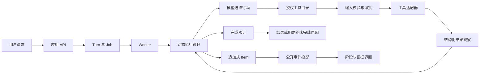

# 结构化编排设计

本轮依据根目录《智能体与工具编排.md》重构运行契约与交互边界。目标是让工具是否可执行、结果是否可信、任务当前状态在执行、审计和界面之间保持一致。

## 设计依据与落地

| 参考内容 | 项目中的落地 |
| --- | --- |
| 第 6 节：模型、指令、工具、护栏 | 模型客户端负责调用；HarnessVersion 固定指令和策略；ToolCatalog 固定授权工具及执行绑定；输入、审批和结果校验形成执行边界。 |
| 第 10、19、24 节：应用与循环分工 | 保留应用自管的动态循环。API 管身份和提交，Worker 管领取与租约，运行时决定行动，工具适配器实际执行。 |
| 第 20、44 节：专家返回与控制权交接 | 现有同步专家调用属于“智能体作为工具”，结果返回管理者。子任务事件保留作用域，不能覆盖主任务的计划和终态。 |
| 第 21 节：审批暂停与恢复 | 审批在消息旁展示；提交期间防止重复操作，失败保留重试入口。历史回放和任务快照共同恢复等待审批状态。 |
| 第 34、45 节：工具契约与有界失败 | 模型可见目录和执行分派共用授权目录。结构化失败、MCP 错误及不满足输入契约的请求不能成为成功证据。缓存保留原观察事实。 |
| 第 35、38、57 节：外部状态分层 | Thread 管对话上下文，Turn/Item 管运行及审计，工作区管文件，长期记忆由独立模块检索；不重复注入另一套服务端会话状态。 |
| 第 40、47、49 节：依据评估增加复杂度 | 以现有单智能体和受约束工具执行为基线，增加针对真实缺陷的回归和浏览器验收。没有引入托管 PTC、SDK 或新的固定流程画布。 |

参考稿中的模型、beta 产品及 API 示例保留其原稿时点含义，不作为当前项目已接入能力的声明。

## 模块职责

| 层次 | 主要文件 | 输入与输出 |
| --- | --- | --- |
| 请求与业务控制 | `backend/api/chat.py` | 已认证请求 → 能力快照和持久 Turn；审批、取消、历史查询和流式传输。 |
| 调度与状态 | `backend/jobs.py`、`worker.py`、`runtime/task_store.py` | 排队、租约、有限重试；Project → Thread → Turn → Item 的追加式事实。 |
| 运行策略 | `backend/runtime/policies.py`、`loop.py` | 不可变策略与运行检查点；预算、状态及完成条件。 |
| 工具契约 | `backend/runtime/tool_contracts.py` | 工具定义、类别、输入 Schema、执行绑定 → 策略筛选后的授权目录。 |
| 执行与观察 | `backend/runtime/orchestrator.py`、`control.py`、`llm/mcp_client.py` | 已授权调用 → 输入校验、审批、执行 → 结构化观察及证据计数。 |
| 结果评测 | `backend/runtime/evaluation.py` | 实际执行与产物 → 验证结论、缺口、受限完成状态及 Evidence Tree。 |
| 公开运行视图 | `backend/runtime/process_view.py` | 内部事件 → 白名单字段、调用身份和主子任务作用域；实时流和历史回放共用。 |
| 交互投影 | `frontend/static/run-workspace.js` | 公开事实 → 阶段投影、事件类别、审批提交状态和滚动跟随判断。 |
| 页面协调 | `frontend/static/app.js`、`index.html`、`style.css` | 消息、计划、审批、运行详情与可恢复连接的交互及布局。 |

图中表达职责和数据关系，实际工具路径仍由本轮目标、模型判断和观察动态决定。界面的“准备、决策、行动、观察、验证”表示已经发生的状态，不要求任务依次走完所有阶段。

## 关键不变量

1. 工具必须在本轮授权目录中才能执行。模型猜出一个真实工具名，不能绕过禁用策略；工具候选路由仅影响模型上下文，不授予权限。
2. 审批继续由服务端绑定到用户、执行任务、智能体和操作范围。界面按钮不能自行授予工具权限。
3. `ok: false`、`isError: true` 和明确错误结果保留失败事实；展示摘要与缓存命中不能改变事实或虚增证据。
4. 实时流和重连回放使用相同公开字段。工具参数、原始输出、私有推理不混入公开检查点。
   工具 Item 继续以工具名供审计查询，并保存事件类型；历史记录可根据 kind/status 恢复，刷新后仍能查看工具调用与结果。回放显示事件实际发生时间。
5. 子智能体的终态和计划属于自己的作用域；管理者是否完成仍由其自身验证决定。
6. 有回答、循环停止和验证通过是不同状态。存在缺口时继续呈现受限完成或失败，不能显示为全部完成。
7. 读取历史时暂停滚动跟随；“回到最新”恢复跟随。中文输入法确认候选词不会直接发送消息。

## 验证与兼容

沿用 `python -m unittest discover -s tests -p "test_*.py"` 运行回归，并运行 `python tools/check_javascript.py` 检查所有前端脚本。新增测试覆盖工具授权、输入与结果契约、缓存失败保持、主子任务隔离、公开流字段一致性、阶段投影和审批状态。

浏览器验收使用独立数据目录、数据库及关闭 Worker 的本地预览服务，检查审批恢复与操作、事件筛选、阅读时滚动、窄屏和暗色显示。演示任务不代表真实模型或外部 MCP 已完成端到端执行。

本轮不改变数据库表结构和 Harness 发布数据。已有默认项目 SQLite 锁修复保留。

2026-09-13 最终验证：289 项完整回归通过，Python 编译、5 个前端脚本语法及差异格式检查通过。隔离浏览器验收覆盖审批恢复、批准、失败重试与拒绝停止、工具回放与筛选、历史时间、滚动跟随、桌面侧栏和窄屏暗色。
详细记录及截图位于 `output/playwright/orchestration/`。现有业务服务未重启；外部模型、MCP 与生产渠道未作真实端到端运行验证。
